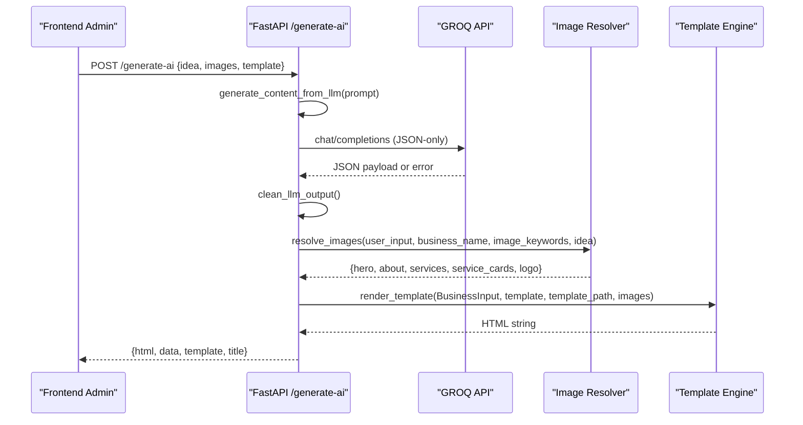
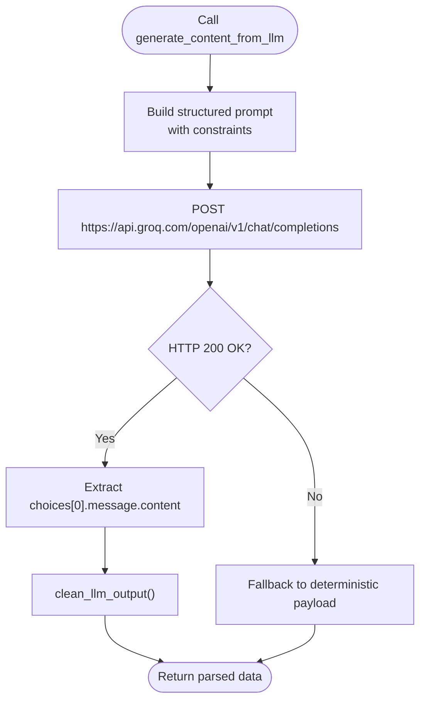
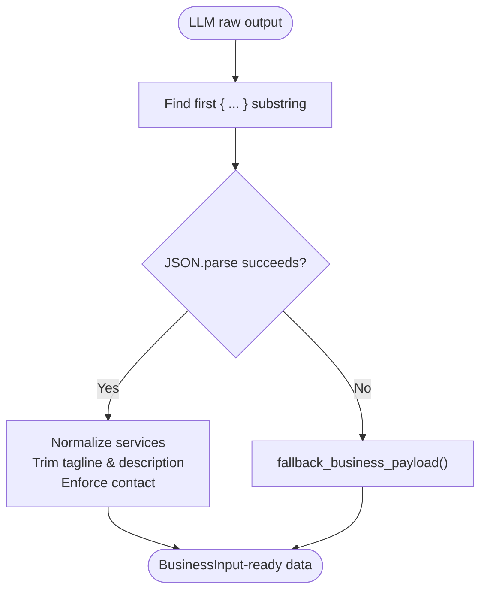
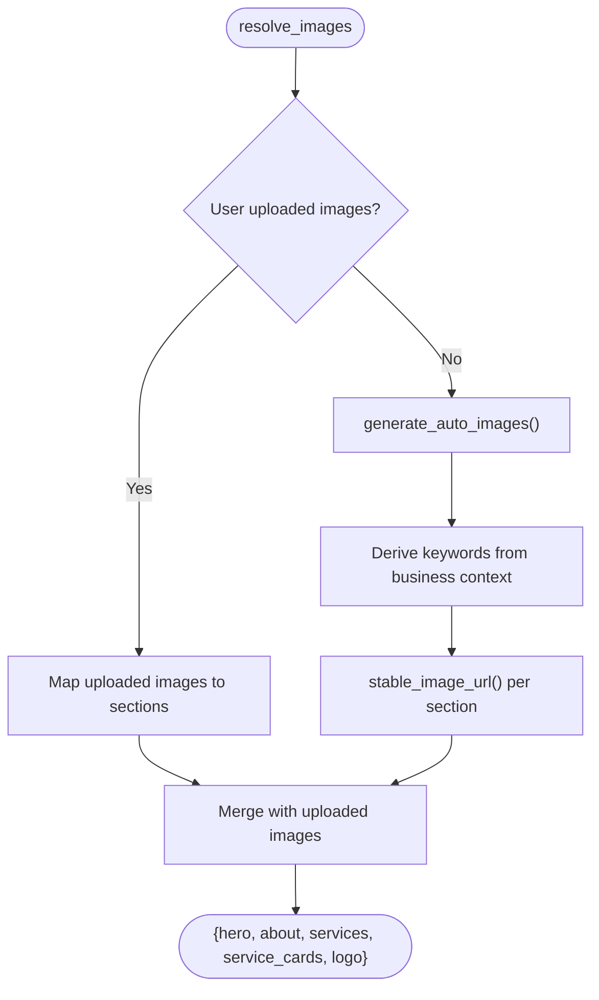
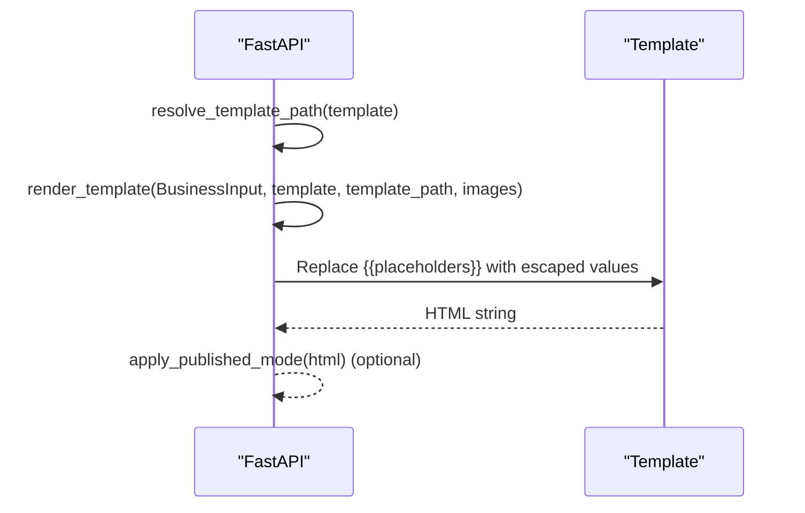
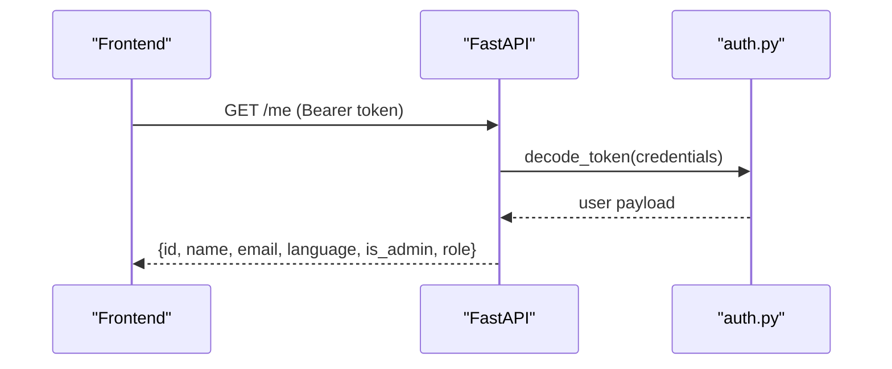
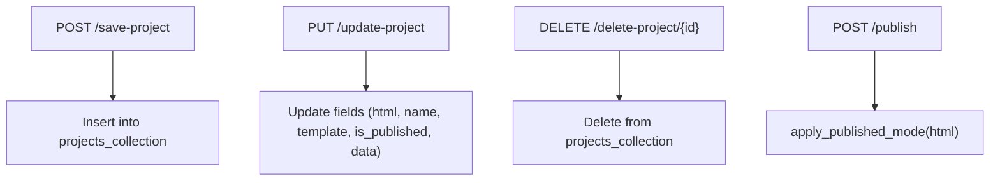
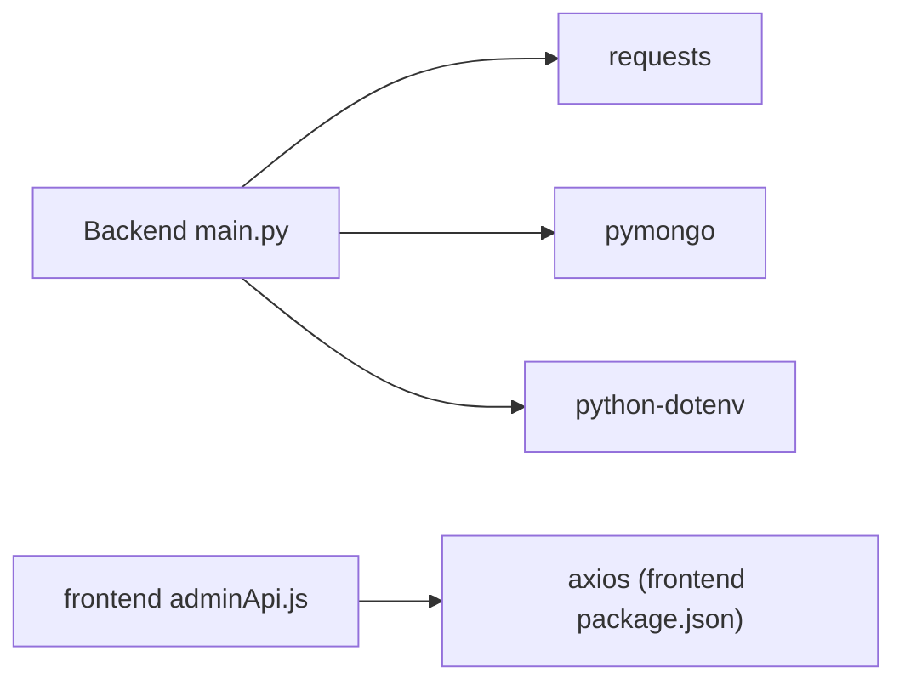

# AI Integration

<cite>
**Referenced Files in This Document**
- [main.py](file://Backend/main.py)
- [db.py](file://Backend/db.py)
- [auth.py](file://Backend/auth.py)
- [generic.html](file://Backend/templates/generic.html)
- [modern.html](file://Backend/templates/modern.html)
- [luxury.html](file://Backend/templates/luxury.html)
- [creative.html](file://Backend/templates/creative.html)
- [adminApi.js](file://frontend/src/services/adminApi.js)
- [requirements.txt](file://Backend/requirements.txt)
</cite>

## Table of Contents
1. [Introduction](#introduction)
2. [Project Structure](#project-structure)
3. [Core Components](#core-components)
4. [Architecture Overview](#architecture-overview)
5. [Detailed Component Analysis](#detailed-component-analysis)
6. [Dependency Analysis](#dependency-analysis)
7. [Performance Considerations](#performance-considerations)
8. [Troubleshooting Guide](#troubleshooting-guide)
9. [Conclusion](#conclusion)

## Introduction
This document describes the AI-powered content generation system integrated with the GROQ API. It covers the end-to-end workflow from a user’s business idea to a fully rendered, templated website with automatic image generation. The system includes robust fallbacks, error handling, and offline-friendly rendering. It also documents the integration patterns with the frontend admin dashboard and the template system used to produce responsive, branded websites.

## Project Structure
The system is split into:
- Backend (Python/FastAPI): AI content generation, image generation, template rendering, authentication, and persistence.
- Frontend (React): Admin dashboard and analytics, integrating with the backend APIs.
- Templates (HTML/CSS): Four distinct website templates that render the final website content.

```mermaid
graph TB
subgraph "Frontend"
FE_Admin["Admin Dashboard<br/>React SPA"]
FE_API["adminApi.js<br/>HTTP client"]
end
subgraph "Backend"
BE_API["FastAPI app<br/>main.py"]
BE_DB["MongoDB collections<br/>db.py"]
BE_AUTH["JWT auth helpers<br/>auth.py"]
BE_TPL["Templates<br/>generic.html, modern.html, luxury.html, creative.html"]
end
FE_Admin --> FE_API
FE_API --> BE_API
BE_API --> BE_DB
BE_API --> BE_AUTH
BE_API --> BE_TPL
```

**Diagram sources**
- [main.py:34-1099](file://Backend/main.py#L34-L1099)
- [db.py:1-16](file://Backend/db.py#L1-L16)
- [auth.py:1-19](file://Backend/auth.py#L1-L19)
- [generic.html:1-462](file://Backend/templates/generic.html#L1-L462)
- [modern.html:1-509](file://Backend/templates/modern.html#L1-L509)
- [luxury.html:1-359](file://Backend/templates/luxury.html#L1-L359)
- [creative.html:1-464](file://Backend/templates/creative.html#L1-L464)
- [adminApi.js:1-266](file://frontend/src/services/adminApi.js#L1-L266)

**Section sources**
- [main.py:34-1099](file://Backend/main.py#L34-L1099)
- [requirements.txt:1-9](file://Backend/requirements.txt#L1-L9)

## Core Components
- GROQ API integration for content generation with strict JSON constraints and deterministic fallbacks.
- Automatic image generation using keyword-based deterministic URLs and fallbacks.
- Template engine that renders four distinct website layouts with placeholders replaced by business data.
- Authentication and authorization with JWT bearer tokens.
- Persistence layer for user accounts and projects.

Key responsibilities:
- Content generation: [generate_content_from_llm:647-712](file://Backend/main.py#L647-L712)
- Image resolution: [resolve_images:797-840](file://Backend/main.py#L797-L840)
- Template rendering: [render_template:545-594](file://Backend/main.py#L545-L594)
- Authentication: [get_current_user:305-323](file://Backend/main.py#L305-L323), [create_token:16-19](file://Backend/auth.py#L16-L19)
- Project persistence: [save_project:969-985](file://Backend/main.py#L969-L985), [update_project:990-1030](file://Backend/main.py#L990-L1030)

**Section sources**
- [main.py:623-712](file://Backend/main.py#L623-L712)
- [main.py:797-840](file://Backend/main.py#L797-L840)
- [main.py:545-594](file://Backend/main.py#L545-L594)
- [auth.py:16-19](file://Backend/auth.py#L16-L19)
- [main.py:969-1030](file://Backend/main.py#L969-L1030)

## Architecture Overview
The AI integration follows a request-response flow:
1. Frontend sends a business idea and optional images to the backend.
2. Backend validates the request and calls GROQ API to generate structured JSON content.
3. On failure, the system falls back to deterministic content generation.
4. Images are either user-provided or generated deterministically from business context.
5. The chosen template renders the final HTML with placeholders replaced by business data and images.
6. The backend returns the HTML and metadata to the frontend.

**Diagram sources**
- [main.py:856-939](file://Backend/main.py#L856-L939)
- [main.py:647-712](file://Backend/main.py#L647-L712)
- [main.py:797-840](file://Backend/main.py#L797-L840)
- [main.py:545-594](file://Backend/main.py#L545-L594)

## Detailed Component Analysis

### GROQ API Integration and Prompt Engineering
- API configuration: The backend reads the GROQ API key from environment variables and constructs a request to the chat completions endpoint with a model optimized for instant responses.
- Prompt engineering: The prompt enforces strict JSON output, constrains field lengths, and provides explicit examples for name, tagline, description, services, and contact information. It also requests keyword sets for automatic image generation.
- Response handling: The system extracts the assistant message content and parses it as JSON. If parsing fails, it falls back to deterministic content generation.

**Diagram sources**
- [main.py:647-712](file://Backend/main.py#L647-L712)

**Section sources**
- [main.py:623-712](file://Backend/main.py#L623-L712)

### JSON Response Parsing and Validation
- The backend cleans the raw LLM output by extracting the first JSON object and attempting to parse it.
- It normalizes services into a list of strings, ensures the tagline is under eight words, and limits the description to two sentences and a word cap.
- It enriches contact information with user-provided email if present.

**Diagram sources**
- [main.py:716-907](file://Backend/main.py#L716-L907)

**Section sources**
- [main.py:716-907](file://Backend/main.py#L716-L907)

### Automatic Image Generation and Resolution
- Deterministic image URLs: The system generates stable image URLs using a keyword-based seed to ensure reproducibility across sessions.
- Keyword derivation: It builds keyword sets for hero, about, and services from the business name, description, and LLM suggestions.
- Image resolution: If the user uploads images, they are prioritized; otherwise, the system generates deterministic images. Service cards receive three images, each seeded differently.

**Diagram sources**
- [main.py:797-840](file://Backend/main.py#L797-L840)
- [main.py:735-764](file://Backend/main.py#L735-L764)
- [main.py:724-732](file://Backend/main.py#L724-L732)

**Section sources**
- [main.py:797-840](file://Backend/main.py#L797-L840)
- [main.py:735-764](file://Backend/main.py#L735-L764)
- [main.py:724-732](file://Backend/main.py#L724-L732)

### Template Rendering and Business Payload
- Template selection: The backend resolves the requested template to one of the four supported templates, with legacy aliases mapped to modern equivalents.
- Rendering: The template engine replaces placeholders with escaped business data and image URLs. It injects a small script to handle broken images gracefully.
- Business payload: The system constructs a validated BusinessInput object and passes it to the template renderer.

**Diagram sources**
- [main.py:436-594](file://Backend/main.py#L436-L594)
- [generic.html:1-462](file://Backend/templates/generic.html#L1-L462)
- [modern.html:1-509](file://Backend/templates/modern.html#L1-L509)
- [luxury.html:1-359](file://Backend/templates/luxury.html#L1-L359)
- [creative.html:1-464](file://Backend/templates/creative.html#L1-L464)

**Section sources**
- [main.py:436-594](file://Backend/main.py#L436-L594)

### Authentication and Authorization
- JWT-based authentication: The backend uses HS256 with a secret key to encode and decode tokens. It exposes a protected route to fetch the current user profile.
- Frontend integration: The admin API client attaches a Bearer token header when available.

**Diagram sources**
- [main.py:305-323](file://Backend/main.py#L305-L323)
- [auth.py:16-19](file://Backend/auth.py#L16-L19)
- [adminApi.js:60-65](file://frontend/src/services/adminApi.js#L60-L65)

**Section sources**
- [main.py:305-323](file://Backend/main.py#L305-L323)
- [auth.py:16-19](file://Backend/auth.py#L16-L19)
- [adminApi.js:60-65](file://frontend/src/services/adminApi.js#L60-L65)

### Project Persistence and Publishing
- Save/update/delete projects: The backend persists projects with user_id, name, template, data, and HTML. It supports updating HTML and metadata and toggling publication status.
- Published mode: The backend can apply a “published” class to the body element to enable a read-only presentation mode.

**Diagram sources**
- [main.py:969-1030](file://Backend/main.py#L969-L1030)
- [main.py:1060-1091](file://Backend/main.py#L1060-L1091)

**Section sources**
- [main.py:969-1030](file://Backend/main.py#L969-L1030)
- [main.py:1060-1091](file://Backend/main.py#L1060-L1091)

## Dependency Analysis
External dependencies and integrations:
- FastAPI and Uvicorn for the HTTP server and routing.
- Requests for outbound GROQ API calls.
- PyMongo for MongoDB connectivity.
- python-dotenv for environment variable loading.
- Frontend uses axios for HTTP requests to the backend.

**Diagram sources**
- [requirements.txt:1-9](file://Backend/requirements.txt#L1-L9)
- [adminApi.js:10](file://frontend/src/services/adminApi.js#L10)
- [package.json:10](file://frontend/package.json#L10)

**Section sources**
- [requirements.txt:1-9](file://Backend/requirements.txt#L1-L9)
- [adminApi.js:10](file://frontend/src/services/adminApi.js#L10)
- [package.json:10](file://frontend/package.json#L10)

## Performance Considerations
- Timeout and reliability: The GROQ API call uses a 30-second timeout to prevent hanging requests.
- Deterministic image generation: Using keyword-based seeds ensures consistent, cacheable image URLs and reduces variability in response times.
- Template rendering: The backend escapes values and injects minimal JavaScript to handle broken images, reducing layout thrashing.
- Rate limiting: The system does not implement explicit rate limiting at the API level; consider adding rate limiting middleware or external throttling if deployed at scale.

[No sources needed since this section provides general guidance]

## Troubleshooting Guide
Common issues and remedies:
- Missing GROQ API key: The system falls back to deterministic content generation. Ensure the environment variable is configured for production use.
- Invalid AI response: The backend attempts to extract a JSON object from the raw output. If parsing fails, it returns a fallback payload.
- Broken images: The template injection includes an error handler that switches to a fallback image URL when an image fails to load.
- Authentication failures: Ensure the frontend includes a valid Bearer token in requests to protected routes.
- Template file missing: The backend logs warnings and falls back to a generic template if the requested template is unavailable.

**Section sources**
- [main.py:687-711](file://Backend/main.py#L687-L711)
- [main.py:716-722](file://Backend/main.py#L716-L722)
- [main.py:579-594](file://Backend/main.py#L579-L594)
- [main.py:305-323](file://Backend/main.py#L305-L323)
- [main.py:456-466](file://Backend/main.py#L456-L466)

## Conclusion
The AI integration leverages GROQ API to generate structured, brand-aligned content and pairs it with deterministic image generation and a flexible template system. The backend provides robust fallbacks, safe rendering, and straightforward persistence for projects. The frontend integrates seamlessly via a typed HTTP client, enabling administrators to manage users, websites, and analytics. For production deployments, consider adding rate limiting, monitoring, and caching strategies to improve scalability and resilience.