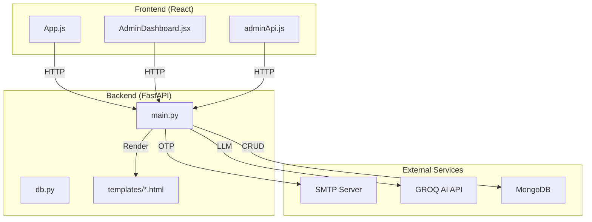
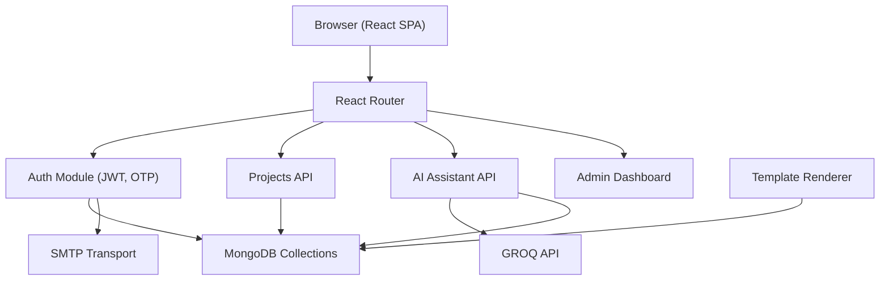
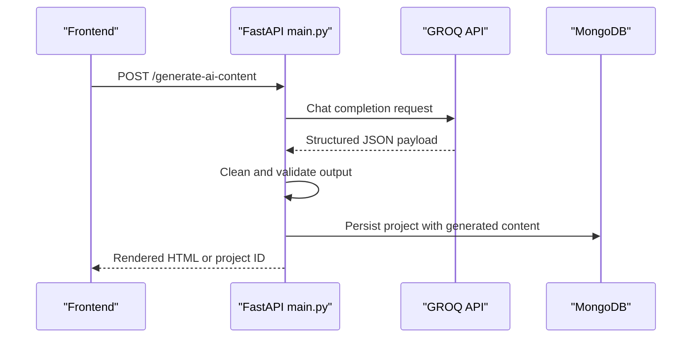
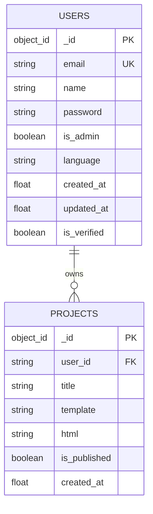
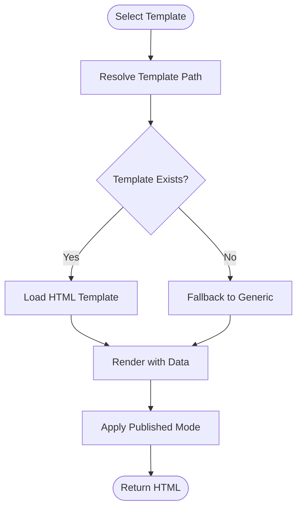
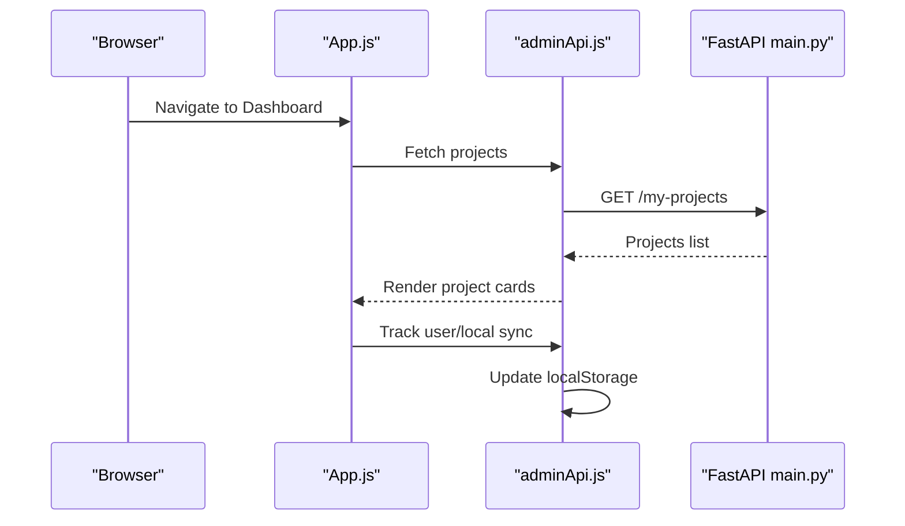
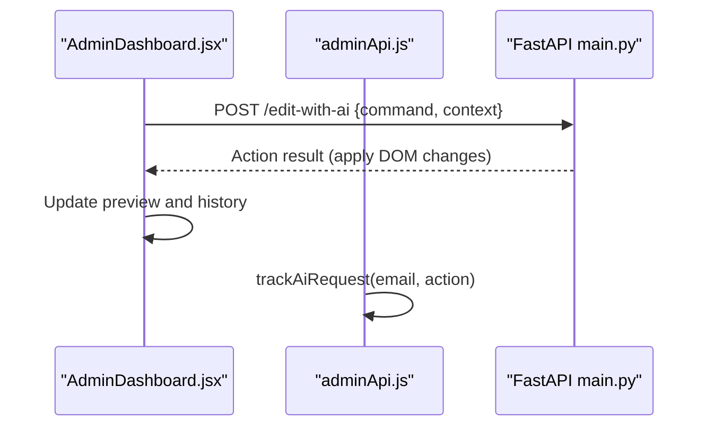
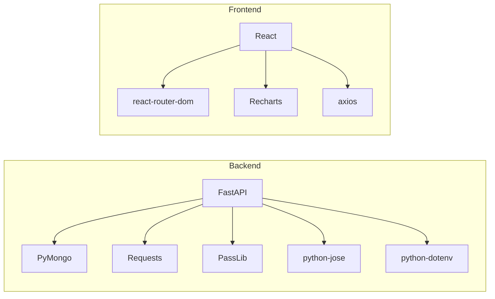

# Architecture & Technology Stack

<cite>
**Referenced Files in This Document**
- [main.py](file://Backend/main.py)
- [db.py](file://Backend/db.py)
- [auth.py](file://Backend/auth.py)
- [generic.html](file://Backend/templates/generic.html)
- [modern.html](file://Backend/templates/modern.html)
- [luxury.html](file://Backend/templates/luxury.html)
- [creative.html](file://Backend/templates/creative.html)
- [requirements.txt](file://Backend/requirements.txt)
- [App.js](file://frontend/src/App.js)
- [AdminDashboard.jsx](file://frontend/src/pages/AdminDashboard.jsx)
- [adminApi.js](file://frontend/src/services/adminApi.js)
- [package.json](file://frontend/package.json)
- [index.html](file://frontend/public/index.html)
</cite>

## Table of Contents
1. [Introduction](#introduction)
2. [Project Structure](#project-structure)
3. [Core Components](#core-components)
4. [Architecture Overview](#architecture-overview)
5. [Detailed Component Analysis](#detailed-component-analysis)
6. [Dependency Analysis](#dependency-analysis)
7. [Performance Considerations](#performance-considerations)
8. [Troubleshooting Guide](#troubleshooting-guide)
9. [Conclusion](#conclusion)

## Introduction
This document describes the NITT Website Builder system’s full-stack architecture. The platform enables users to quickly generate professional business websites using AI-driven content generation powered by GROQ, template rendering with FastAPI, and a React-based frontend. MongoDB stores user and project data, while SMTP integration supports OTP-based authentication. The system emphasizes modularity, scalability, and a smooth developer and user experience.

## Project Structure
The system is organized into two primary layers:
- Backend: FastAPI application serving REST endpoints, managing authentication, integrating with MongoDB, generating AI content via GROQ, and rendering HTML templates.
- Frontend: React SPA providing user registration, login, OTP verification, dashboard, and admin analytics.

**Diagram sources**
- [main.py](file://Backend/main.py)
- [db.py](file://Backend/db.py)
- [generic.html](file://Backend/templates/generic.html)
- [App.js](file://frontend/src/App.js)
- [AdminDashboard.jsx](file://frontend/src/pages/AdminDashboard.jsx)
- [adminApi.js](file://frontend/src/services/adminApi.js)

**Section sources**
- [main.py](file://Backend/main.py)
- [db.py](file://Backend/db.py)
- [App.js](file://frontend/src/App.js)
- [AdminDashboard.jsx](file://frontend/src/pages/AdminDashboard.jsx)
- [adminApi.js](file://frontend/src/services/adminApi.js)

## Core Components
- FastAPI Backend
  - Authentication: JWT-based bearer tokens, password hashing, OTP via SMTP.
  - Data Access: MongoDB collections for users and projects.
  - AI Integration: GROQ chat completions for content generation with deterministic fallback.
  - Template Rendering: Server-side HTML generation from Jinja-like placeholders and per-template styles.
- React Frontend
  - Routing and session management with protected routes.
  - Admin dashboard with analytics and AI assistant.
  - Local-first persistence with localStorage for offline resilience and admin metrics.
- Infrastructure
  - CORS enabled for cross-origin requests.
  - Environment variables for secrets and external API keys.

**Section sources**
- [main.py](file://Backend/main.py)
- [db.py](file://Backend/db.py)
- [App.js](file://frontend/src/App.js)
- [adminApi.js](file://frontend/src/services/adminApi.js)
- [requirements.txt](file://Backend/requirements.txt)

## Architecture Overview
The system follows a classic client-server model with a thin React frontend and a feature-rich FastAPI backend. The backend exposes REST endpoints for authentication, project management, AI-assisted editing, and admin analytics. The frontend consumes these endpoints and renders interactive dashboards and previews.

**Diagram sources**
- [main.py](file://Backend/main.py)
- [db.py](file://Backend/db.py)
- [App.js](file://frontend/src/App.js)
- [AdminDashboard.jsx](file://frontend/src/pages/AdminDashboard.jsx)
- [adminApi.js](file://frontend/src/services/adminApi.js)

## Detailed Component Analysis

### Backend: FastAPI Application
- Startup and Admin Seed
  - On startup, seeds an admin user and ensures consistent credentials for development.
- CORS
  - Configured to accept all origins for local development; adjust for production environments.
- Authentication
  - Password hashing with PBKDF2 and JWT signing with HS256.
  - OTP via SMTP using Gmail SMTP; logs and errors are emitted for diagnostics.
- Endpoints
  - Registration, OTP verification, login, profile retrieval, and admin endpoints for users and stats.
- Template Rendering
  - Validates and resolves requested templates; builds service markup and injects fallback image handling.
  - Applies “published” mode by adding a class to the body element.
- AI Content Generation
  - Calls GROQ chat completions with a structured prompt and temperature tuning.
  - Falls back to deterministic content when the API is unavailable.
- Image Generation
  - Deterministic image URLs seeded by keywords for consistent visuals when user uploads are absent.

**Diagram sources**
- [main.py](file://Backend/main.py)

**Section sources**
- [main.py](file://Backend/main.py)
- [db.py](file://Backend/db.py)

### Database Layer
- MongoDB collections
  - Users: authentication, roles, and metadata.
  - Projects: website drafts and published content with associated user IDs.

**Diagram sources**
- [db.py](file://Backend/db.py)
- [main.py](file://Backend/main.py)

**Section sources**
- [db.py](file://Backend/db.py)

### Template System
- Supported templates: Generic, Modern, Luxury, Creative.
- Each template defines a distinct layout and styling scheme.
- Server-side rendering replaces placeholders with user-provided content and images.

**Diagram sources**
- [generic.html](file://Backend/templates/generic.html)
- [modern.html](file://Backend/templates/modern.html)
- [luxury.html](file://Backend/templates/luxury.html)
- [creative.html](file://Backend/templates/creative.html)
- [main.py](file://Backend/main.py)

**Section sources**
- [main.py](file://Backend/main.py)
- [generic.html](file://Backend/templates/generic.html)
- [modern.html](file://Backend/templates/modern.html)
- [luxury.html](file://Backend/templates/luxury.html)
- [creative.html](file://Backend/templates/creative.html)

### Frontend: React SPA
- Routing and Guards
  - ProtectedRoute and AdminRoute enforce authentication and role checks.
- Authentication Flow
  - Registration with PAN validation, OTP verification via backend, and JWT login.
- Dashboard and Admin
  - Dashboard lists projects, allows preview and deletion.
  - Admin dashboard aggregates stats, charts, and user management.
- Local Persistence
  - Tracks users, websites, and AI usage locally for offline support and admin insights.

**Diagram sources**
- [App.js](file://frontend/src/App.js)
- [adminApi.js](file://frontend/src/services/adminApi.js)
- [main.py](file://Backend/main.py)

**Section sources**
- [App.js](file://frontend/src/App.js)
- [AdminDashboard.jsx](file://frontend/src/pages/AdminDashboard.jsx)
- [adminApi.js](file://frontend/src/services/adminApi.js)

### AI Assistant Integration
- Admin AI Assistant
  - Sends commands to backend endpoint for AI-assisted edits.
  - Applies DOM transformations in the preview pane and maintains undo history.
- Local AI Logging
  - Records AI actions for analytics and distribution charts.

**Diagram sources**
- [AdminDashboard.jsx](file://frontend/src/pages/AdminDashboard.jsx)
- [adminApi.js](file://frontend/src/services/adminApi.js)
- [main.py](file://Backend/main.py)

**Section sources**
- [AdminDashboard.jsx](file://frontend/src/pages/AdminDashboard.jsx)
- [adminApi.js](file://frontend/src/services/adminApi.js)
- [main.py](file://Backend/main.py)

## Dependency Analysis
- Backend Dependencies
  - FastAPI, Uvicorn, python-multipart, requests, passlib, python-jose, pymongo, python-dotenv.
- Frontend Dependencies
  - React, react-router-dom, axios, recharts, testing libraries.

**Diagram sources**
- [requirements.txt](file://Backend/requirements.txt)
- [package.json](file://frontend/package.json)

**Section sources**
- [requirements.txt](file://Backend/requirements.txt)
- [package.json](file://frontend/package.json)

## Performance Considerations
- Template Rendering
  - Regex-based placeholder replacement is efficient for typical website sizes; avoid excessive dynamic content updates in the preview pane.
- Image Handling
  - Deterministic image URLs reduce network variability; fallbacks ensure resilience.
- AI Requests
  - Cache repeated prompts on the frontend to minimize redundant calls.
- Database Queries
  - Indexes on user email and project user_id improve lookup performance.
- CORS
  - Limit allowed origins and headers in production to reduce overhead.

## Troubleshooting Guide
- Authentication
  - Ensure SMTP credentials are configured; backend logs OTP attempts and exceptions.
  - Verify JWT secret and algorithm alignment between frontend and backend.
- CORS Issues
  - Confirm allowed origins and headers; restrict in production.
- Template Rendering
  - Validate template existence and fallback logic; check placeholder keys.
- AI Content
  - If GROQ API fails, confirm fallback logic and prompt formatting.
- Frontend Admin
  - Use localStorage fallbacks for admin data when backend is unreachable.

**Section sources**
- [main.py](file://Backend/main.py)
- [adminApi.js](file://frontend/src/services/adminApi.js)

## Conclusion
NITT Website Builder combines a robust FastAPI backend with a modular React frontend to deliver an efficient, extensible solution. The backend’s AI integration, template rendering, and MongoDB-backed persistence provide a scalable foundation, while the frontend’s routing, admin dashboard, and local-first design ensure a responsive user experience. With careful CORS and security configurations, the system is well-positioned for production deployment.