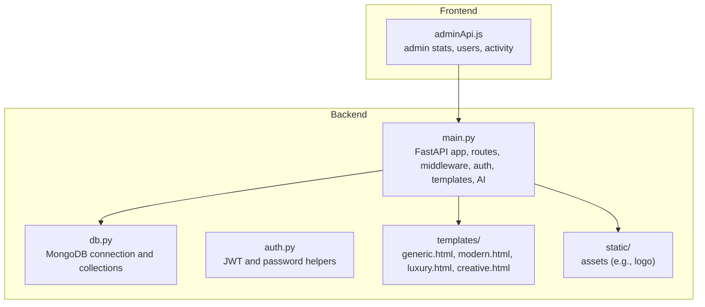
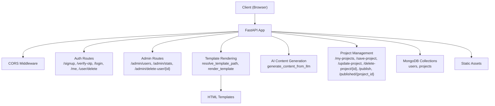
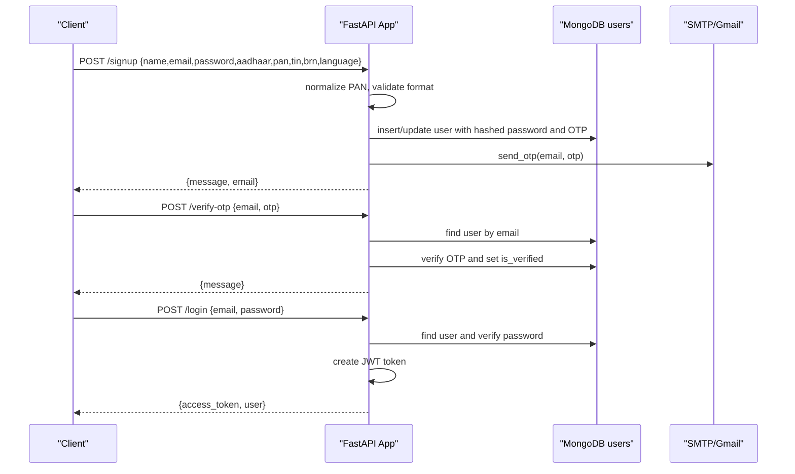
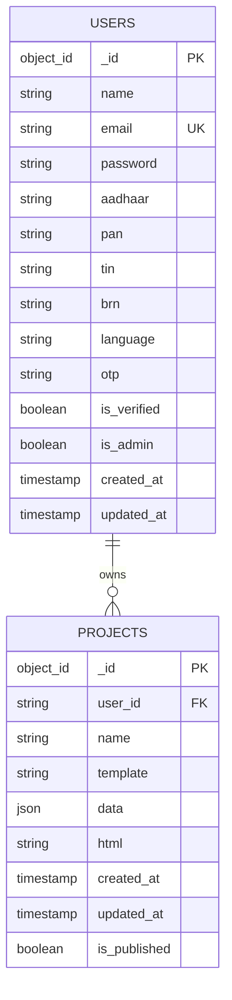
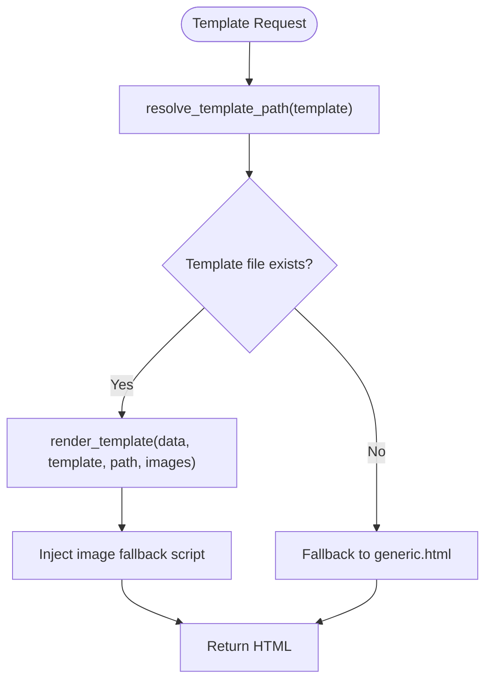
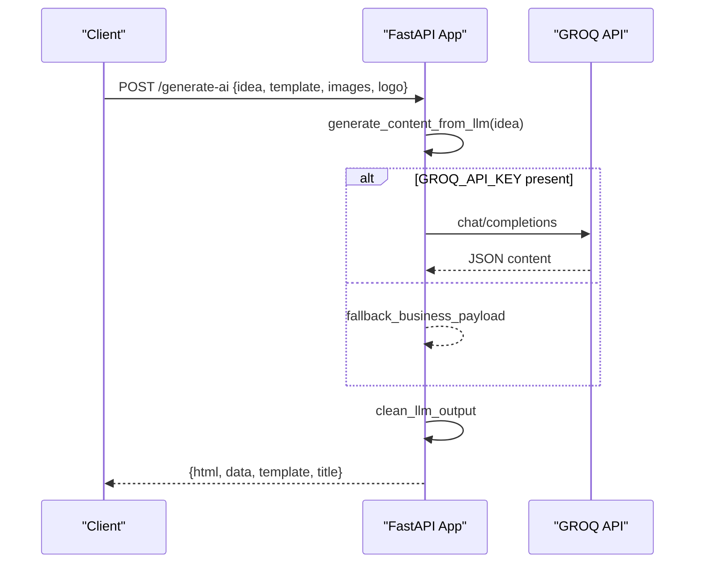
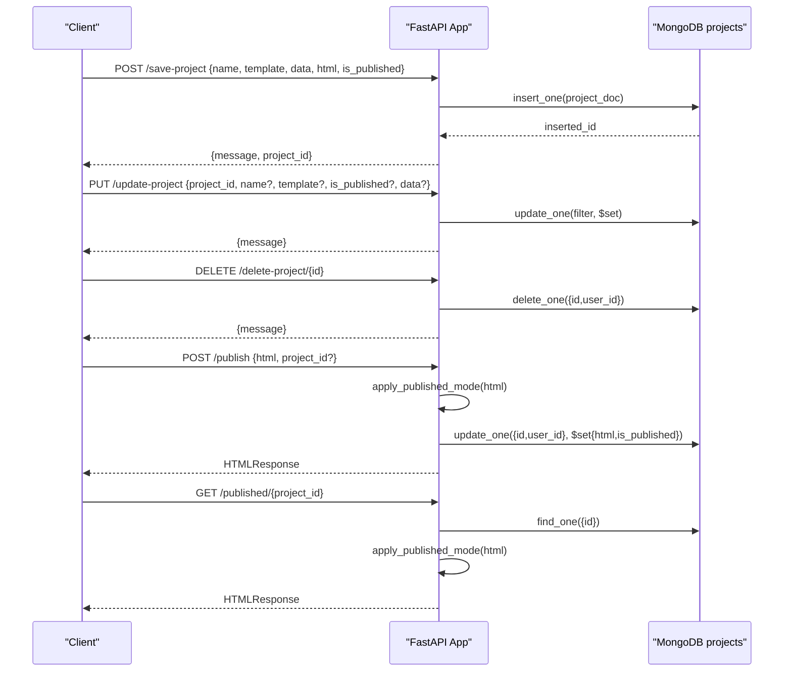
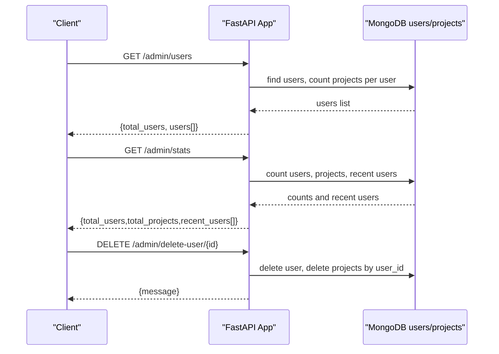
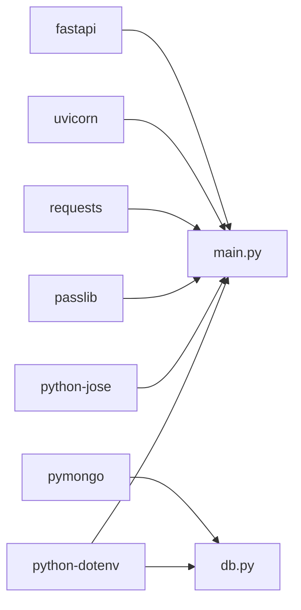

# Backend System

<cite>
**Referenced Files in This Document**
- [main.py](file://Backend/main.py)
- [db.py](file://Backend/db.py)
- [auth.py](file://Backend/auth.py)
- [requirements.txt](file://Backend/requirements.txt)
- [generic.html](file://Backend/templates/generic.html)
- [modern.html](file://Backend/templates/modern.html)
- [adminApi.js](file://frontend/src/services/adminApi.js)
</cite>

## Table of Contents
1. [Introduction](#introduction)
2. [Project Structure](#project-structure)
3. [Core Components](#core-components)
4. [Architecture Overview](#architecture-overview)
5. [Detailed Component Analysis](#detailed-component-analysis)
6. [Dependency Analysis](#dependency-analysis)
7. [Performance Considerations](#performance-considerations)
8. [Troubleshooting Guide](#troubleshooting-guide)
9. [Conclusion](#conclusion)
10. [Appendices](#appendices)

## Introduction
This document describes the backend system for the NITT Website Builder, a FastAPI application that powers user authentication, website generation with AI, project management, and admin analytics. It covers application structure, CORS configuration, middleware, error handling, authentication with PAN validation and OTP verification, JWT token management, password security with Passlib, MongoDB integration, template engine for dynamic HTML rendering, AI integration with GROQ API, and admin functionality for user analytics and management.

## Project Structure
The backend is organized around a single FastAPI application module, a database module, and a small shared auth helper. Templates are served from the templates directory, and static assets are served from the static directory. The frontend integrates with the backend via HTTP endpoints.

**Diagram sources**
- [main.py:34-38](file://Backend/main.py#L34-L38)
- [db.py:8-16](file://Backend/db.py#L8-L16)
- [auth.py:1-19](file://Backend/auth.py#L1-L19)
- [generic.html:1-462](file://Backend/templates/generic.html#L1-L462)
- [modern.html:1-509](file://Backend/templates/modern.html#L1-L509)
- [adminApi.js:1-266](file://frontend/src/services/adminApi.js#L1-L266)

**Section sources**
- [main.py:34-38](file://Backend/main.py#L34-L38)
- [db.py:8-16](file://Backend/db.py#L8-L16)

## Core Components
- FastAPI Application: Central app initialization, CORS middleware, and route groups for auth, admin, template rendering, AI content generation, and project management.
- Authentication: User registration with PAN validation, OTP verification, login, JWT token creation/decoding, and protected routes.
- Database: MongoDB connection and collections for users and projects.
- Template Engine: Dynamic HTML rendering with placeholders and image resolution.
- AI Integration: GROQ API content generation with deterministic fallbacks.
- Admin System: Analytics, user listing, stats, and user deletion.

**Section sources**
- [main.py:34-38](file://Backend/main.py#L34-L38)
- [main.py:72-78](file://Backend/main.py#L72-L78)
- [main.py:87-107](file://Backend/main.py#L87-L107)
- [db.py:8-16](file://Backend/db.py#L8-L16)

## Architecture Overview
The backend follows a layered architecture:
- Entry point initializes FastAPI, loads environment, sets CORS, and seeds admin.
- Middleware stack includes CORS.
- Routers group endpoints by concern: auth, admin, template rendering, AI, and projects.
- Data access uses PyMongo against MongoDB collections.
- Template rendering injects business data into HTML templates and applies published mode.

**Diagram sources**
- [main.py:34-38](file://Backend/main.py#L34-L38)
- [main.py:72-78](file://Backend/main.py#L72-L78)
- [main.py:169-329](file://Backend/main.py#L169-L329)
- [main.py:339-415](file://Backend/main.py#L339-L415)
- [main.py:436-623](file://Backend/main.py#L436-L623)
- [main.py:628-775](file://Backend/main.py#L628-L775)
- [main.py:861-944](file://Backend/main.py#L861-L944)
- [main.py:949-1056](file://Backend/main.py#L949-L1056)
- [main.py:1065-1096](file://Backend/main.py#L1065-L1096)
- [db.py:8-16](file://Backend/db.py#L8-L16)

## Detailed Component Analysis

### FastAPI Application and Middleware
- Application initialization and admin seeding on startup.
- CORS configured to allow all origins, credentials, methods, and headers.
- Global error handling via HTTPException raised from routes and helpers.

Key behaviors:
- Startup hook ensures admin credentials exist and are synchronized.
- Logging configured for operational visibility.

**Section sources**
- [main.py:34-68](file://Backend/main.py#L34-L68)
- [main.py:72-78](file://Backend/main.py#L72-L78)
- [main.py:31-33](file://Backend/main.py#L31-L33)

### Authentication System
Endpoints:
- POST /signup: Validates PAN format, hashes password, stores user, generates OTP, sends OTP via email, and returns message.
- GET /test-email: Sends a test OTP to a configured test email.
- POST /verify-otp: Verifies OTP and marks user as verified.
- POST /login: Authenticates user, checks OTP verification, and issues JWT.
- GET /me: Returns current user profile.
- DELETE /user/delete: Deletes current user and associated projects.

Validation and security:
- PAN validation enforced with a strict regex.
- Password hashing via Passlib pbkdf2_sha256.
- JWT HS256 with configurable secret key and 24-hour expiry.
- Token-based protection via HTTPBearer dependency.

**Diagram sources**
- [main.py:195-248](file://Backend/main.py#L195-L248)
- [main.py:257-283](file://Backend/main.py#L257-L283)
- [main.py:285-298](file://Backend/main.py#L285-L298)
- [main.py:305-329](file://Backend/main.py#L305-L329)
- [main.py:119-165](file://Backend/main.py#L119-L165)

**Section sources**
- [main.py:169-193](file://Backend/main.py#L169-L193)
- [main.py:195-248](file://Backend/main.py#L195-L248)
- [main.py:257-283](file://Backend/main.py#L257-L283)
- [main.py:285-298](file://Backend/main.py#L285-L298)
- [main.py:305-329](file://Backend/main.py#L305-L329)
- [auth.py:1-19](file://Backend/auth.py#L1-L19)

### Database Integration with MongoDB
- Connection URI loaded from environment variable MONGODB_URI with default fallback.
- Two collections: users and projects.
- Admin seeding writes to users collection and synchronizes password.

Data model highlights:
- Users: name, email, password (hashed), aadhaar, pan, tin, brn, language, otp, is_verified, is_admin, timestamps.
- Projects: user_id, name, template, data, html, timestamps, is_published.

**Diagram sources**
- [db.py:8-16](file://Backend/db.py#L8-L16)
- [main.py:42-64](file://Backend/main.py#L42-L64)
- [main.py:979-990](file://Backend/main.py#L979-L990)

**Section sources**
- [db.py:8-16](file://Backend/db.py#L8-L16)
- [main.py:42-64](file://Backend/main.py#L42-L64)
- [main.py:979-990](file://Backend/main.py#L979-L990)

### Template Engine Architecture
- Template selection resolves legacy aliases and validates against allowed set.
- Template rendering injects business data and images, with fallbacks for missing images.
- Published mode toggles a CSS class on the body element for production-like rendering.

Key functions:
- resolve_template_path: selects template and validates existence.
- render_template: reads template, replaces placeholders, injects image fallback script.
- apply_published_mode: adds a published class to the body tag.

**Diagram sources**
- [main.py:445-467](file://Backend/main.py#L445-L467)
- [main.py:545-599](file://Backend/main.py#L545-L599)
- [main.py:601-616](file://Backend/main.py#L601-L616)

**Section sources**
- [main.py:436-467](file://Backend/main.py#L436-L467)
- [main.py:545-599](file://Backend/main.py#L545-L599)
- [main.py:601-616](file://Backend/main.py#L601-L616)
- [generic.html:1-462](file://Backend/templates/generic.html#L1-L462)
- [modern.html:1-509](file://Backend/templates/modern.html#L1-L509)

### AI Integration with GROQ API
- Generates structured JSON content describing a business website.
- Falls back to deterministic content when API key is missing or request fails.
- Cleans LLM output to extract JSON boundaries and validates structure.

**Diagram sources**
- [main.py:861-944](file://Backend/main.py#L861-L944)
- [main.py:628-717](file://Backend/main.py#L628-L717)
- [main.py:721-728](file://Backend/main.py#L721-L728)

**Section sources**
- [main.py:628-717](file://Backend/main.py#L628-L717)
- [main.py:721-728](file://Backend/main.py#L721-L728)
- [main.py:861-944](file://Backend/main.py#L861-L944)

### Project Management System
- List projects: GET /my-projects
- Save project: POST /save-project
- Update project: PUT /update-project
- Delete project: DELETE /delete-project/{id}
- Publish project: POST /publish and GET /published/{project_id}

**Diagram sources**
- [main.py:949-970](file://Backend/main.py#L949-L970)
- [main.py:974-990](file://Backend/main.py#L974-L990)
- [main.py:995-1035](file://Backend/main.py#L995-L1035)
- [main.py:1039-1056](file://Backend/main.py#L1039-L1056)
- [main.py:1065-1096](file://Backend/main.py#L1065-L1096)

**Section sources**
- [main.py:949-970](file://Backend/main.py#L949-L970)
- [main.py:974-990](file://Backend/main.py#L974-L990)
- [main.py:995-1035](file://Backend/main.py#L995-L1035)
- [main.py:1039-1056](file://Backend/main.py#L1039-L1056)
- [main.py:1065-1096](file://Backend/main.py#L1065-L1096)

### Admin System
- Requires admin role via dependency.
- Endpoints:
  - GET /admin/users: Lists users with project counts and created_at normalization.
  - GET /admin/stats: Returns totals and recent users.
  - DELETE /admin/delete-user/{id}: Deletes user and associated projects.

**Diagram sources**
- [main.py:339-415](file://Backend/main.py#L339-L415)
- [main.py:374-400](file://Backend/main.py#L374-L400)
- [main.py:402-415](file://Backend/main.py#L402-L415)

**Section sources**
- [main.py:339-415](file://Backend/main.py#L339-L415)
- [main.py:374-400](file://Backend/main.py#L374-L400)
- [main.py:402-415](file://Backend/main.py#L402-L415)

### Frontend Integration Notes
- The frontend consumes backend endpoints via fetch calls and stores session tokens locally.
- Admin dashboard uses adminApi.js to fetch stats, users, and activity, with localStorage fallbacks.

**Section sources**
- [adminApi.js:1-266](file://frontend/src/services/adminApi.js#L1-L266)

## Dependency Analysis
External libraries and their roles:
- fastapi: Web framework and routing.
- uvicorn: ASGI server.
- python-multipart: Form parsing.
- requests: HTTP client for GROQ API.
- passlib: Password hashing.
- python-jose: JWT encoding/decoding.
- pymongo: MongoDB driver.
- python-dotenv: Environment variable loading.

**Diagram sources**
- [requirements.txt:1-9](file://Backend/requirements.txt#L1-L9)
- [main.py:1-29](file://Backend/main.py#L1-L29)
- [db.py:1-9](file://Backend/db.py#L1-L9)

**Section sources**
- [requirements.txt:1-9](file://Backend/requirements.txt#L1-L9)
- [main.py:1-29](file://Backend/main.py#L1-L29)
- [db.py:1-9](file://Backend/db.py#L1-L9)

## Performance Considerations
- Template rendering uses regex substitution and file I/O; keep templates minimal and cache where feasible.
- Image resolution uses deterministic URLs; ensure network reliability for fallbacks.
- MongoDB queries use simple filters; consider indexing on frequently queried fields (e.g., email, user_id).
- JWT token lifetime is 24 hours; adjust SECRET_KEY and consider refresh tokens for long sessions.
- CORS allows all origins; restrict origins in production deployments.

## Troubleshooting Guide
Common issues and resolutions:
- CORS errors: Verify allow_origins configuration and preflight handling.
- Authentication failures: Confirm JWT secret key and token expiration; ensure user is verified.
- Email OTP delivery: Check SMTP_USER and SMTP_PASS environment variables; verify Gmail App Password configuration.
- MongoDB connectivity: Validate MONGODB_URI and network access.
- Template rendering errors: Ensure template files exist and are readable; confirm placeholder replacement logic.

**Section sources**
- [main.py:72-78](file://Backend/main.py#L72-L78)
- [main.py:87-107](file://Backend/main.py#L87-L107)
- [main.py:119-165](file://Backend/main.py#L119-L165)
- [db.py:8-16](file://Backend/db.py#L8-L16)
- [main.py:445-467](file://Backend/main.py#L445-L467)

## Conclusion
The NITT Website Builder backend provides a robust foundation for user authentication, AI-driven website generation, project lifecycle management, and admin analytics. Its modular design, clear separation of concerns, and extensible template engine enable rapid iteration and deployment. Production readiness requires tightening CORS, securing environment variables, and monitoring AI and database performance.

## Appendices

### API Endpoint Reference

- Authentication
  - POST /signup: Registers user with PAN validation, OTP, and email delivery.
  - GET /test-email: Sends a test OTP to a configured email.
  - POST /verify-otp: Verifies OTP and marks user as verified.
  - POST /login: Issues JWT for authenticated users.
  - GET /me: Returns current user profile.
  - DELETE /user/delete: Deletes current user and projects.

- Admin
  - GET /admin/users: Lists users with project counts and normalized timestamps.
  - GET /admin/stats: Returns totals and recent users.
  - DELETE /admin/delete-user/{id}: Deletes user and projects.

- Template Rendering
  - GET /nit-trichy-logo.png: Serves static logo asset.
  - GET /published/{project_id}: Returns published HTML for a project.

- AI Content Generation
  - POST /generate-ai: Generates website content and returns HTML and data.

- Project Management
  - GET /my-projects: Lists user’s projects.
  - POST /save-project: Saves a new project.
  - PUT /update-project: Updates an existing project.
  - DELETE /delete-project/{id}: Deletes a project.
  - POST /publish: Publishes a project and returns HTML.

**Section sources**
- [main.py:195-248](file://Backend/main.py#L195-L248)
- [main.py:257-283](file://Backend/main.py#L257-L283)
- [main.py:285-298](file://Backend/main.py#L285-L298)
- [main.py:321-329](file://Backend/main.py#L321-L329)
- [main.py:339-415](file://Backend/main.py#L339-L415)
- [main.py:618-623](file://Backend/main.py#L618-L623)
- [main.py:1084-1096](file://Backend/main.py#L1084-L1096)
- [main.py:861-944](file://Backend/main.py#L861-L944)
- [main.py:949-1056](file://Backend/main.py#L949-L1056)
- [main.py:1065-1096](file://Backend/main.py#L1065-L1096)