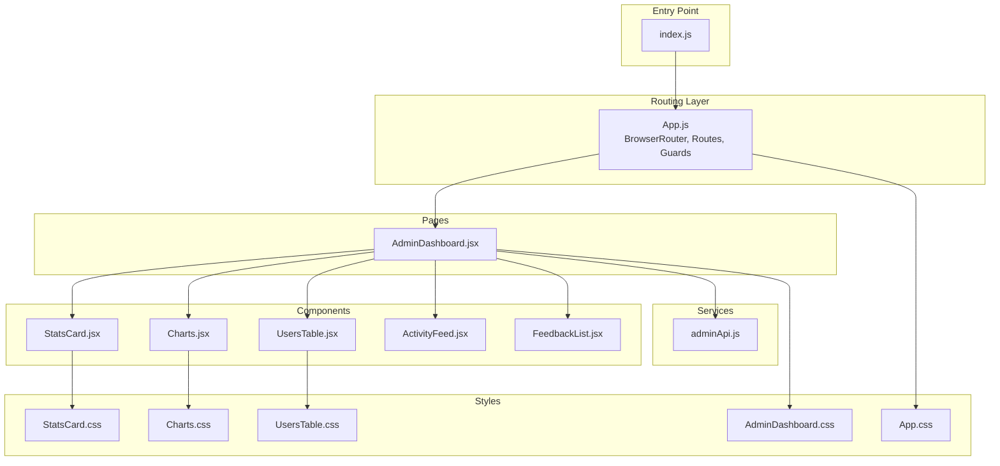
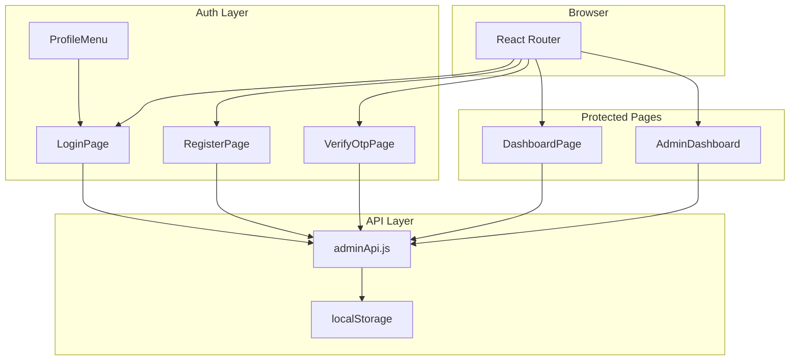
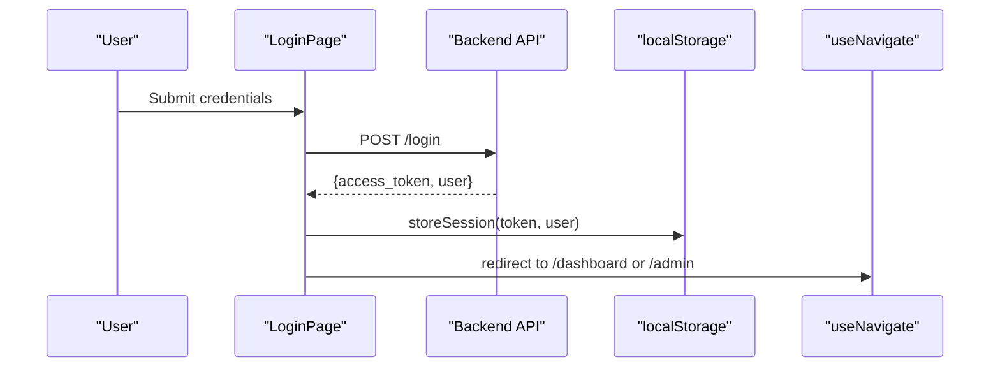
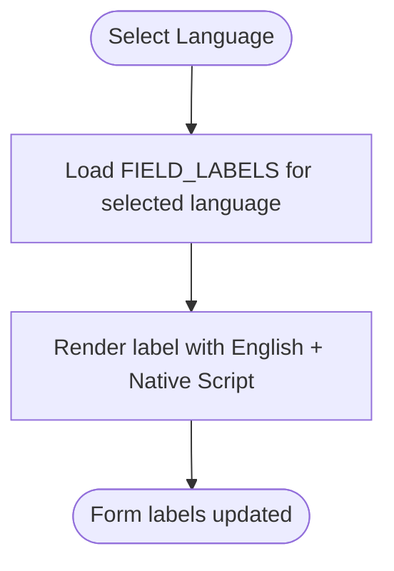
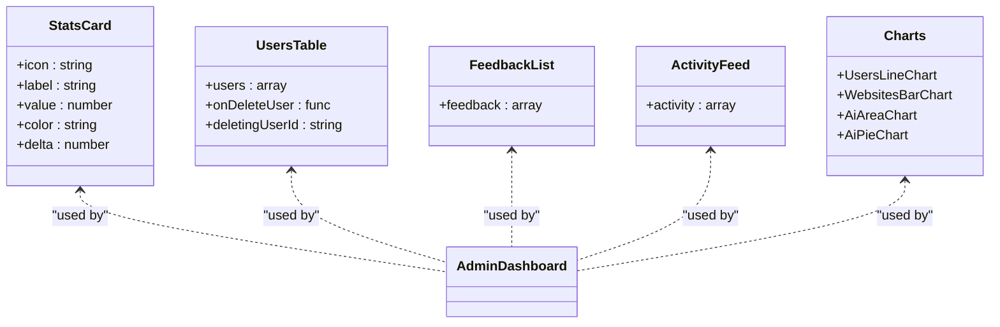
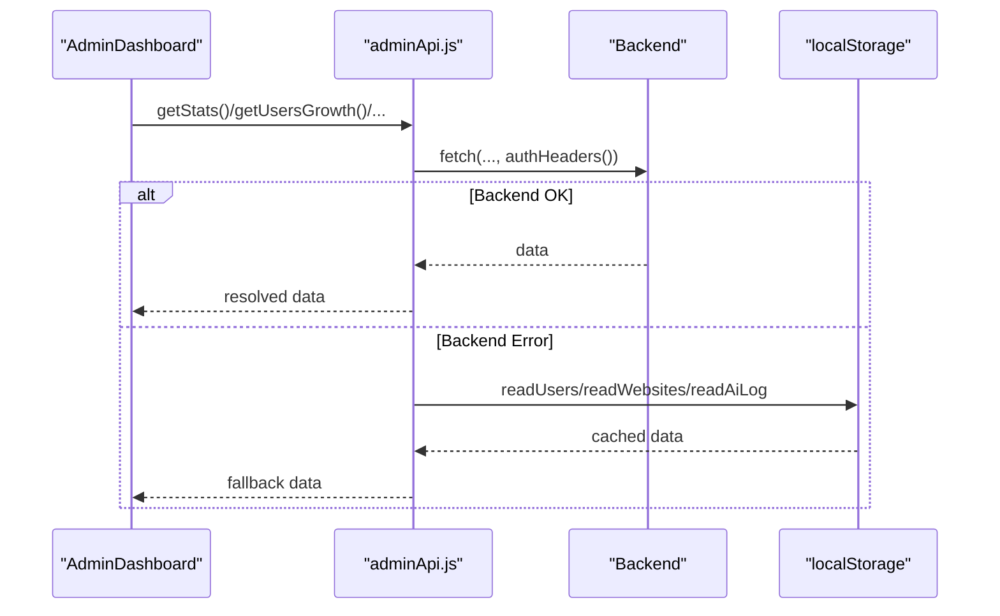
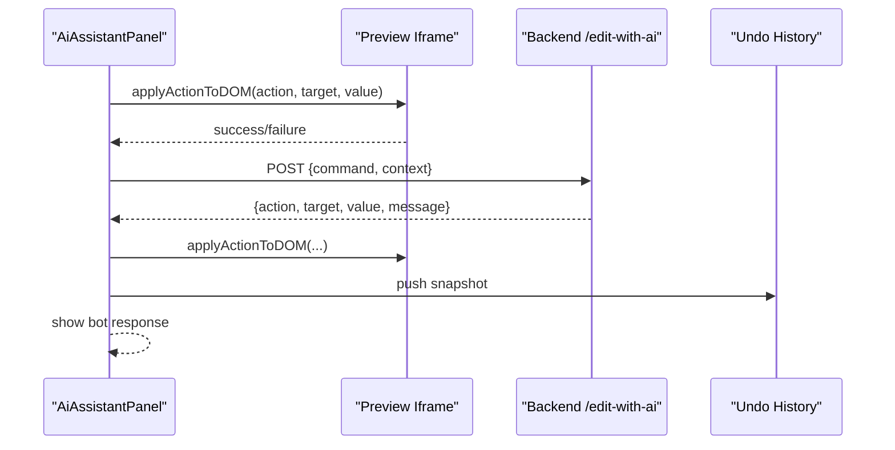
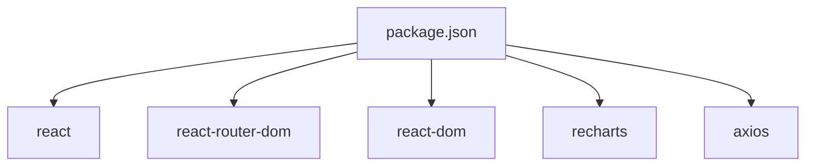

# Frontend System

<cite>
**Referenced Files in This Document**
- [App.js](file://frontend/src/App.js)
- [index.js](file://frontend/src/index.js)
- [package.json](file://frontend/package.json)
- [AdminDashboard.jsx](file://frontend/src/pages/AdminDashboard.jsx)
- [adminApi.js](file://frontend/src/services/adminApi.js)
- [ActivityFeed.jsx](file://frontend/src/components/ActivityFeed.jsx)
- [Charts.jsx](file://frontend/src/components/Charts.jsx)
- [FeedbackList.jsx](file://frontend/src/components/FeedbackList.jsx)
- [StatsCard.jsx](file://frontend/src/components/StatsCard.jsx)
- [UsersTable.jsx](file://frontend/src/components/UsersTable.jsx)
- [App.css](file://frontend/src/App.css)
- [AdminDashboard.css](file://frontend/src/pages/AdminDashboard.css)
- [Charts.css](file://frontend/src/components/Charts.css)
- [StatsCard.css](file://frontend/src/components/StatsCard.css)
- [UsersTable.css](file://frontend/src/components/UsersTable.css)
</cite>

## Table of Contents
1. [Introduction](#introduction)
2. [Project Structure](#project-structure)
3. [Core Components](#core-components)
4. [Architecture Overview](#architecture-overview)
5. [Detailed Component Analysis](#detailed-component-analysis)
6. [Dependency Analysis](#dependency-analysis)
7. [Performance Considerations](#performance-considerations)
8. [Troubleshooting Guide](#troubleshooting-guide)
9. [Conclusion](#conclusion)
10. [Appendices](#appendices)

## Introduction
This document describes the frontend system of the React-based NITT Website Builder. It covers application structure, routing, state management patterns, authentication and session handling, internationalization, UI component library, API integration, styling and responsiveness, and accessibility. The frontend integrates with a backend API to support user registration, login, project management, and administrative analytics.

## Project Structure
The frontend is a standard Create React App project with a clear separation of concerns:
- Pages: Application routes and page-level components
- Components: Reusable UI components
- Services: API integration layer
- Styles: Global and component-specific CSS
- Entry point: Root render setup

**Diagram sources**
- [index.js:1-18](file://frontend/src/index.js#L1-L18)
- [App.js:1-1815](file://frontend/src/App.js#L1-L1815)
- [AdminDashboard.jsx:1-356](file://frontend/src/pages/AdminDashboard.jsx#L1-L356)
- [adminApi.js:1-266](file://frontend/src/services/adminApi.js#L1-L266)
- [ActivityFeed.jsx:1-22](file://frontend/src/components/ActivityFeed.jsx#L1-L22)
- [Charts.jsx:1-113](file://frontend/src/components/Charts.jsx#L1-L113)
- [FeedbackList.jsx:1-48](file://frontend/src/components/FeedbackList.jsx#L1-L48)
- [StatsCard.jsx:1-20](file://frontend/src/components/StatsCard.jsx#L1-L20)
- [UsersTable.jsx:1-105](file://frontend/src/components/UsersTable.jsx#L1-L105)
- [App.css:1-1125](file://frontend/src/App.css#L1-L1125)
- [AdminDashboard.css:1-136](file://frontend/src/pages/AdminDashboard.css#L1-L136)
- [Charts.css:1-28](file://frontend/src/components/Charts.css#L1-L28)
- [StatsCard.css:1-49](file://frontend/src/components/StatsCard.css#L1-L49)
- [UsersTable.css:1-93](file://frontend/src/components/UsersTable.css#L1-L93)

**Section sources**
- [index.js:1-18](file://frontend/src/index.js#L1-L18)
- [package.json:1-43](file://frontend/package.json#L1-L43)

## Core Components
- Authentication and session management: Token storage, role-based access, protected routes, and profile menu
- Internationalization: Bilingual labels for form fields and dynamic label rendering
- UI component library: StatsCard, Charts, UsersTable, FeedbackList, ActivityFeed
- API integration: Local storage tracking and admin analytics service
- Routing: ProtectedRoute, PublicOnlyRoute, AdminRoute guards

Key implementation references:
- Session helpers and route guards: [App.js:123-192](file://frontend/src/App.js#L123-L192)
- Authentication forms and flows: [App.js:268-552](file://frontend/src/App.js#L268-L552)
- Internationalization dictionaries and label helpers: [App.js:83-121](file://frontend/src/App.js#L83-L121), [App.js:324-347](file://frontend/src/App.js#L324-L347)
- Admin dashboard and AI assistant: [AdminDashboard.jsx:1-356](file://frontend/src/pages/AdminDashboard.jsx#L1-L356)
- API service module: [adminApi.js:1-266](file://frontend/src/services/adminApi.js#L1-L266)

**Section sources**
- [App.js:83-192](file://frontend/src/App.js#L83-L192)
- [App.js:268-552](file://frontend/src/App.js#L268-L552)
- [AdminDashboard.jsx:1-356](file://frontend/src/pages/AdminDashboard.jsx#L1-L356)
- [adminApi.js:1-266](file://frontend/src/services/adminApi.js#L1-L266)

## Architecture Overview
The frontend uses React Router for navigation and guards to protect routes. Authentication state is stored in localStorage. The admin dashboard composes reusable components and integrates with the admin API service for analytics and user management.

**Diagram sources**
- [App.js:181-248](file://frontend/src/App.js#L181-L248)
- [App.js:268-552](file://frontend/src/App.js#L268-L552)
- [AdminDashboard.jsx:1-356](file://frontend/src/pages/AdminDashboard.jsx#L1-L356)
- [adminApi.js:1-266](file://frontend/src/services/adminApi.js#L1-L266)

## Detailed Component Analysis

### Authentication and Session Management
- Token and user metadata are persisted in localStorage upon successful login/register.
- Route guards enforce:
  - ProtectedRoute: requires a valid token
  - PublicOnlyRoute: blocks authenticated users
  - AdminRoute: restricts to admin role
- Profile menu supports logout and destructive actions with confirmation prompts.

**Diagram sources**
- [App.js:268-322](file://frontend/src/App.js#L268-L322)
- [App.js:123-149](file://frontend/src/App.js#L123-L149)
- [App.js:181-192](file://frontend/src/App.js#L181-L192)

**Section sources**
- [App.js:123-192](file://frontend/src/App.js#L123-L192)
- [App.js:268-322](file://frontend/src/App.js#L268-L322)

### Internationalization System
- Field labels support English, Telugu, and Tamil via bilingual dictionaries.
- Dynamic label rendering displays English alongside native script when applicable.
- Language selection influences form labels immediately.

**Diagram sources**
- [App.js:324-347](file://frontend/src/App.js#L324-L347)
- [App.js:83-121](file://frontend/src/App.js#L83-L121)

**Section sources**
- [App.js:83-121](file://frontend/src/App.js#L83-L121)
- [App.js:324-347](file://frontend/src/App.js#L324-L347)

### UI Component Library
Reusable components are designed for consistency and maintainability.

- StatsCard: Displays KPIs with accent color and optional delta indicator.
- Charts: Line, bar, area, and pie charts built with Recharts; responsive containers included.
- UsersTable: Paginated, searchable table with role badges and language labels.
- FeedbackList: Renders star ratings and comments with avatars.
- ActivityFeed: Lists recent activity items with icons and relative timestamps.

**Diagram sources**
- [StatsCard.jsx:1-20](file://frontend/src/components/StatsCard.jsx#L1-L20)
- [UsersTable.jsx:1-105](file://frontend/src/components/UsersTable.jsx#L1-L105)
- [FeedbackList.jsx:1-48](file://frontend/src/components/FeedbackList.jsx#L1-L48)
- [ActivityFeed.jsx:1-22](file://frontend/src/components/ActivityFeed.jsx#L1-L22)
- [Charts.jsx:1-113](file://frontend/src/components/Charts.jsx#L1-L113)
- [AdminDashboard.jsx:1-356](file://frontend/src/pages/AdminDashboard.jsx#L1-L356)

**Section sources**
- [StatsCard.jsx:1-20](file://frontend/src/components/StatsCard.jsx#L1-L20)
- [UsersTable.jsx:1-105](file://frontend/src/components/UsersTable.jsx#L1-L105)
- [FeedbackList.jsx:1-48](file://frontend/src/components/FeedbackList.jsx#L1-L48)
- [ActivityFeed.jsx:1-22](file://frontend/src/components/ActivityFeed.jsx#L1-L22)
- [Charts.jsx:1-113](file://frontend/src/components/Charts.jsx#L1-L113)

### API Integration Layer
The admin API module centralizes:
- Auth headers construction
- Local storage tracking for users, websites, and AI logs
- Fallback logic to localStorage when backend is unavailable
- Analytics queries: stats, growth, per-day counts, AI distribution, users, feedback, activity

**Diagram sources**
- [AdminDashboard.jsx:253-273](file://frontend/src/pages/AdminDashboard.jsx#L253-L273)
- [adminApi.js:139-171](file://frontend/src/services/adminApi.js#L139-L171)
- [adminApi.js:198-225](file://frontend/src/services/adminApi.js#L198-L225)
- [adminApi.js:249-265](file://frontend/src/services/adminApi.js#L249-L265)

**Section sources**
- [adminApi.js:1-266](file://frontend/src/services/adminApi.js#L1-L266)
- [AdminDashboard.jsx:253-273](file://frontend/src/pages/AdminDashboard.jsx#L253-L273)

### Admin Dashboard and AI Assistant
- AdminDashboard composes StatsCard, Charts, UsersTable, FeedbackList, and ActivityFeed.
- AI Assistant panel sends commands to the backend (/edit-with-ai), applies DOM changes to a preview iframe, and maintains an undo history.

**Diagram sources**
- [AdminDashboard.jsx:26-183](file://frontend/src/pages/AdminDashboard.jsx#L26-L183)
- [AdminDashboard.jsx:185-240](file://frontend/src/pages/AdminDashboard.jsx#L185-L240)

**Section sources**
- [AdminDashboard.jsx:1-356](file://frontend/src/pages/AdminDashboard.jsx#L1-L356)

## Dependency Analysis
External dependencies relevant to the frontend system:
- react, react-dom, react-router-dom for UI and routing
- recharts for charting
- axios for HTTP client (declared)

**Diagram sources**
- [package.json:1-43](file://frontend/package.json#L1-L43)

**Section sources**
- [package.json:1-43](file://frontend/package.json#L1-L43)

## Performance Considerations
- Use of localStorage for offline resilience reduces server round trips for admin analytics.
- Recharts containers are responsive; ensure minimal unnecessary re-renders by passing stable props.
- Debounced AI assistant input prevents excessive API calls.
- Pagination in UsersTable limits DOM rendering for large datasets.

## Troubleshooting Guide
Common issues and remedies:
- Authentication failures: Verify token presence and expiration; check error messages returned by the backend.
- Route protection errors: Ensure guards are applied around protected routes and that localStorage reflects current role.
- Admin analytics not loading: Confirm backend availability; the service falls back to localStorage when backend fails.
- AI assistant not applying changes: Confirm preview iframe is accessible and elements match selectors used by applyActionToDOM.

**Section sources**
- [App.js:123-192](file://frontend/src/App.js#L123-L192)
- [adminApi.js:139-171](file://frontend/src/services/adminApi.js#L139-L171)
- [AdminDashboard.jsx:26-183](file://frontend/src/pages/AdminDashboard.jsx#L26-L183)

## Conclusion
The frontend employs a clean separation of concerns with robust routing, authentication guards, and a reusable component library. The admin dashboard leverages a resilient API layer with localStorage fallbacks and an interactive AI assistant for preview editing. The system is extensible and suitable for iterative enhancements to internationalization, analytics, and UI polish.

## Appendices

### Component Usage Examples
- StatsCard: Render KPIs in the admin dashboard with color accents and optional delta indicators.
- Charts: Compose UsersLineChart, WebsitesBarChart, and AiPieChart for analytics.
- UsersTable: Display paginated and searchable user listings with role and language badges.
- FeedbackList: Present user feedback with star ratings and comments.
- ActivityFeed: Show recent activity items with icons and relative timestamps.

**Section sources**
- [StatsCard.jsx:1-20](file://frontend/src/components/StatsCard.jsx#L1-L20)
- [Charts.jsx:1-113](file://frontend/src/components/Charts.jsx#L1-L113)
- [UsersTable.jsx:1-105](file://frontend/src/components/UsersTable.jsx#L1-L105)
- [FeedbackList.jsx:1-48](file://frontend/src/components/FeedbackList.jsx#L1-L48)
- [ActivityFeed.jsx:1-22](file://frontend/src/components/ActivityFeed.jsx#L1-L22)