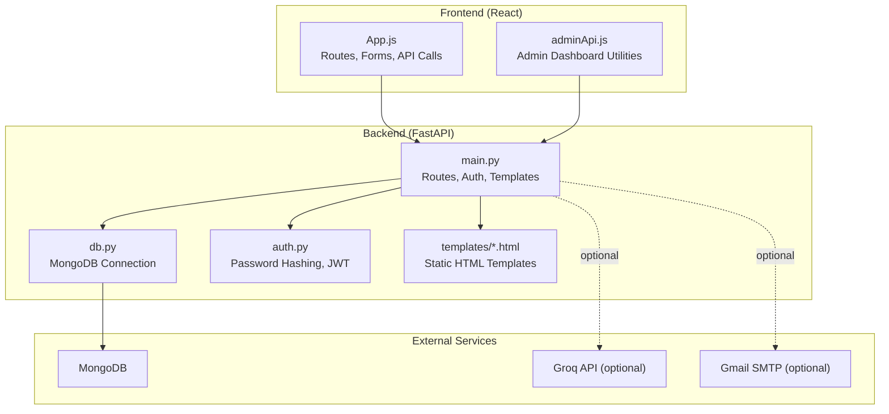
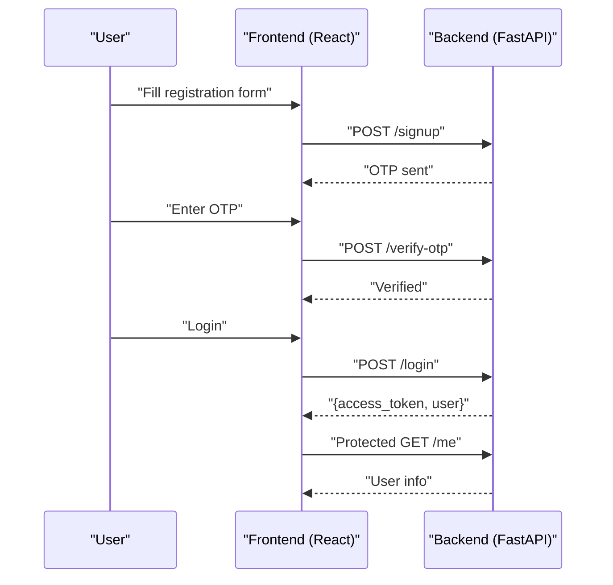
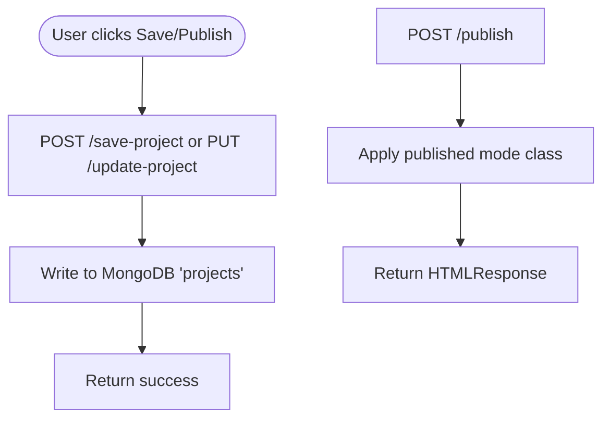
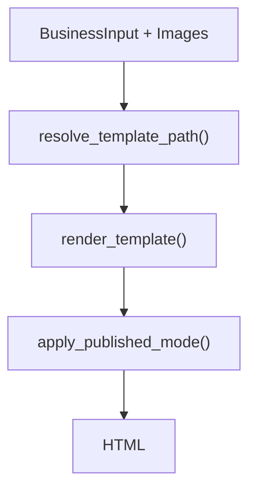
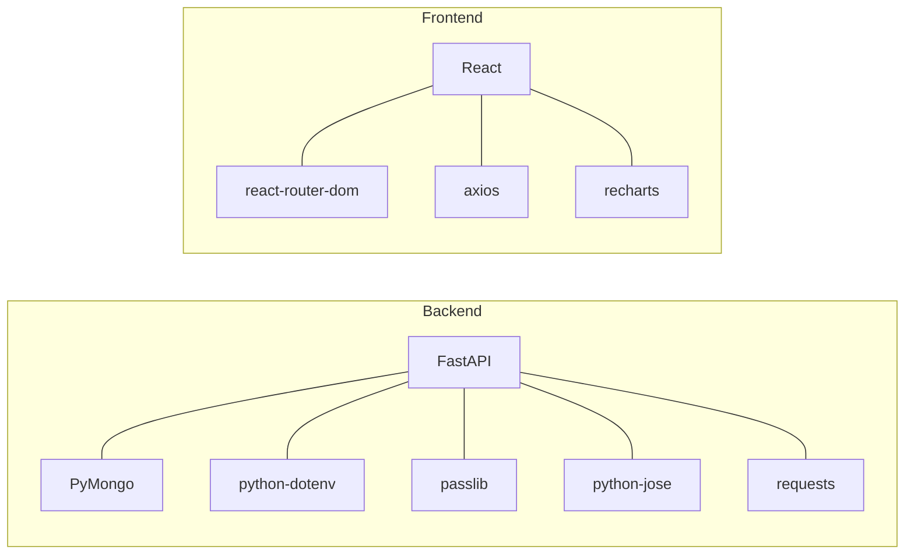

# Getting Started

<cite>
**Referenced Files in This Document**
- [requirements.txt](file://Backend/requirements.txt)
- [package.json](file://frontend/package.json)
- [README.md](file://frontend/README.md)
- [main.py](file://Backend/main.py)
- [db.py](file://Backend/db.py)
- [auth.py](file://Backend/auth.py)
- [generic.html](file://Backend/templates/generic.html)
- [App.js](file://frontend/src/App.js)
- [adminApi.js](file://frontend/src/services/adminApi.js)
- [index.html](file://frontend/public/index.html)
</cite>

## Table of Contents
1. [Introduction](#introduction)
2. [Prerequisites](#prerequisites)
3. [Installation](#installation)
4. [Initial Setup](#initial-setup)
5. [Local Development](#local-development)
6. [First-Time User Walkthrough](#first-time-user-walkthrough)
7. [Architecture Overview](#architecture-overview)
8. [Detailed Component Analysis](#detailed-component-analysis)
9. [Dependency Analysis](#dependency-analysis)
10. [Performance Considerations](#performance-considerations)
11. [Troubleshooting Guide](#troubleshooting-guide)
12. [Verification Checklist](#verification-checklist)
13. [Conclusion](#conclusion)

## Introduction
This guide helps you install and run the NITT Website Builder locally. It covers backend and frontend setup, database configuration, environment variables, and a complete first-time user flow including registration, OTP verification, and creating your first website.

## Prerequisites
- Python 3.8 or newer
- Node.js (with npm)
- MongoDB (local or remote)
- Git (recommended)

Environment variables you will need to configure:
- MONGODB_URI (MongoDB connection string)
- SECRET_KEY (FastAPI JWT signing key)
- GROQ_API_KEY (optional, for AI content generation)
- SMTP_USER and SMTP_PASS (optional, for OTP emails via Gmail)
- TEST_EMAIL (optional, for testing email delivery)

**Section sources**
- [db.py:8](file://Backend/db.py#L8)
- [main.py:87](file://Backend/main.py#L87)
- [main.py:628](file://Backend/main.py#L628)
- [main.py:124](file://Backend/main.py#L124)

## Installation
### Backend (Python/FastAPI)
1. Navigate to the Backend directory.
2. Install dependencies:
   - pip install -r requirements.txt
3. Confirm installation by checking the packages in requirements.txt.

Key backend dependencies include FastAPI, Uvicorn, PyMongo, python-dotenv, passlib, python-jose, and requests.

**Section sources**
- [requirements.txt:1-9](file://Backend/requirements.txt#L1-L9)

### Frontend (React)
1. Navigate to the frontend directory.
2. Install dependencies:
   - npm install
3. Confirm installation by checking the packages in package.json.

Key frontend dependencies include React, React DOM, React Router, Axios, and Recharts.

**Section sources**
- [package.json:5-16](file://frontend/package.json#L5-L16)

## Initial Setup
### Database
- MongoDB is required. By default, the backend connects to mongodb://127.0.0.1:27017 with database name ai_website_builder.
- Ensure MongoDB is running before starting the backend.

Configure the connection via environment variable:
- MONGODB_URI=mongodb://127.0.0.1:27017

**Section sources**
- [db.py:8](file://Backend/db.py#L8)

### Environment Variables
Create a .env file in the Backend directory with the following variables:
- MONGODB_URI (required)
- SECRET_KEY (required for JWT)
- GROQ_API_KEY (optional)
- SMTP_USER (optional, for OTP emails)
- SMTP_PASS (optional, for OTP emails)
- TEST_EMAIL (optional, for email testing)

Notes:
- SECRET_KEY must be set for authentication to work.
- If SMTP_USER and SMTP_PASS are not set, OTP emails will print to the console instead of sending.

**Section sources**
- [db.py:8](file://Backend/db.py#L8)
- [main.py:87](file://Backend/main.py#L87)
- [main.py:124](file://Backend/main.py#L124)
- [main.py:250](file://Backend/main.py#L250)

### Templates
- The backend ships with HTML templates under Backend/templates/. The generic template is used by default.
- Ensure the template files exist so rendering works properly.

**Section sources**
- [generic.html:1](file://Backend/templates/generic.html#L1)

## Local Development
### Backend
- Start the FastAPI server with Uvicorn:
  - uvicorn main:app --reload
- The server listens on the default port configured by Uvicorn.

**Section sources**
- [main.py:34](file://Backend/main.py#L34)

### Frontend
- Start the React development server:
  - npm start
- Open http://localhost:3000 in your browser.

**Section sources**
- [README.md:9-12](file://frontend/README.md#L9-L12)

## First-Time User Walkthrough
Follow these steps to register, verify, log in, and create your first website.

### Step 1: Registration
- Go to the registration page.
- Enter your details including Name, Email, Password, Aadhaar, PAN, optional TIN/BRN, and preferred language.
- Submit the form.
- The system sends an OTP to your email (or prints it to the backend console if SMTP is not configured).

**Section sources**
- [App.js:350-495](file://frontend/src/App.js#L350-L495)
- [main.py:195](file://Backend/main.py#L195)

### Step 2: OTP Verification
- Enter the 6-digit OTP on the verification page.
- On success, you are redirected to the login page automatically.

**Section sources**
- [App.js:497-552](file://frontend/src/App.js#L497-L552)
- [main.py:257](file://Backend/main.py#L257)

### Step 3: Login
- Log in with your email and password.
- After login, you are taken to the dashboard.

**Section sources**
- [App.js:268-322](file://frontend/src/App.js#L268-L322)
- [main.py:286](file://Backend/main.py#L286)

### Step 4: Create Your First Website
- From the dashboard, click “Create Website”.
- Fill in the business idea form (name, description, services, contact).
- Choose a template (Generic, Modern, Luxury, Creative).
- Click “Generate Website”.
- Review the preview, then save or publish your project.

**Section sources**
- [App.js:595-758](file://frontend/src/App.js#L595-L758)
- [main.py:861](file://Backend/main.py#L861)

## Architecture Overview
High-level flow of the application:
- Frontend (React) communicates with the backend (FastAPI) over HTTP.
- Backend stores user data and projects in MongoDB.
- Backend renders static HTML using Jinja-style templates.
- Optional AI content generation uses Groq API.
- Optional OTP emails use SMTP (Gmail).

**Diagram sources**
- [main.py:34](file://Backend/main.py#L34)
- [db.py:10](file://Backend/db.py#L10)
- [auth.py:1](file://Backend/auth.py#L1)
- [generic.html:1](file://Backend/templates/generic.html#L1)
- [App.js:14](file://frontend/src/App.js#L14)
- [adminApi.js:6](file://frontend/src/services/adminApi.js#L6)

## Detailed Component Analysis

### Authentication Flow
End-to-end authentication and session management:
- Registration validates PAN format and stores hashed passwords.
- OTP is generated and sent (via SMTP or printed).
- Login verifies credentials and issues JWT.
- Protected routes enforce bearer token validation.

**Diagram sources**
- [main.py:195](file://Backend/main.py#L195)
- [main.py:257](file://Backend/main.py#L257)
- [main.py:286](file://Backend/main.py#L286)
- [main.py:321](file://Backend/main.py#L321)
- [App.js:350-495](file://frontend/src/App.js#L350-L495)
- [App.js:497-552](file://frontend/src/App.js#L497-L552)
- [App.js:268-322](file://frontend/src/App.js#L268-L322)

**Section sources**
- [main.py:195](file://Backend/main.py#L195)
- [main.py:257](file://Backend/main.py#L257)
- [main.py:286](file://Backend/main.py#L286)
- [main.py:321](file://Backend/main.py#L321)
- [auth.py:10](file://Backend/auth.py#L10)

### Project Management and Publishing
- Users can list, save, update, and delete projects.
- Projects are persisted in MongoDB.
- Publishing wraps HTML with a special class for presentation.

**Diagram sources**
- [main.py:974](file://Backend/main.py#L974)
- [main.py:995](file://Backend/main.py#L995)
- [main.py:1065](file://Backend/main.py#L1065)
- [main.py:1084](file://Backend/main.py#L1084)

**Section sources**
- [main.py:949](file://Backend/main.py#L949)
- [main.py:974](file://Backend/main.py#L974)
- [main.py:995](file://Backend/main.py#L995)
- [main.py:1065](file://Backend/main.py#L1065)
- [main.py:1084](file://Backend/main.py#L1084)

### Template Rendering
- The backend selects a template and renders HTML with dynamic content.
- Fallbacks ensure robustness if images are missing.

**Diagram sources**
- [main.py:436](file://Backend/main.py#L436)
- [main.py:545](file://Backend/main.py#L545)
- [main.py:601](file://Backend/main.py#L601)

**Section sources**
- [main.py:436](file://Backend/main.py#L436)
- [main.py:545](file://Backend/main.py#L545)
- [main.py:601](file://Backend/main.py#L601)
- [generic.html:1](file://Backend/templates/generic.html#L1)

## Dependency Analysis
- Backend depends on FastAPI, PyMongo, python-dotenv, passlib, python-jose, requests, and others.
- Frontend depends on React, React Router, Axios, and Recharts.

**Diagram sources**
- [requirements.txt:1-9](file://Backend/requirements.txt#L1-L9)
- [package.json:5-16](file://frontend/package.json#L5-L16)

**Section sources**
- [requirements.txt:1-9](file://Backend/requirements.txt#L1-L9)
- [package.json:5-16](file://frontend/package.json#L5-L16)

## Performance Considerations
- Keep MongoDB optimized with appropriate indexes on frequently queried fields (e.g., user_id, email).
- Cache static assets (templates, logos) and avoid unnecessary re-renders in the frontend.
- Use production builds for the frontend and run the backend with workers for higher concurrency.

## Troubleshooting Guide
Common issues and fixes:
- Backend cannot connect to MongoDB:
  - Verify MONGODB_URI is correct and MongoDB is running.
  - Check network/firewall settings if connecting remotely.
- Missing environment variables:
  - Ensure SECRET_KEY is set for JWT and optionally GROQ_API_KEY for AI features.
- OTP emails not delivered:
  - Set SMTP_USER and SMTP_PASS for Gmail SMTP. Use an App Password for SMTP_PASS.
  - Alternatively, check backend logs for printed OTP messages.
- Frontend cannot reach backend:
  - Confirm the API_URL in the frontend matches the backend host/port.
  - Check CORS middleware settings in the backend.
- Template rendering errors:
  - Ensure template files exist in Backend/templates/.
- React dev server issues:
  - Clear node_modules and reinstall dependencies if needed.

**Section sources**
- [db.py:8](file://Backend/db.py#L8)
- [main.py:87](file://Backend/main.py#L87)
- [main.py:124](file://Backend/main.py#L124)
- [main.py:628](file://Backend/main.py#L628)
- [App.js:14](file://frontend/src/App.js#L14)
- [generic.html:1](file://Backend/templates/generic.html#L1)

## Verification Checklist
- Backend starts without errors and prints database connection info.
- MongoDB is reachable with the configured URI.
- Environment variables are loaded (check SECRET_KEY, optional SMTP/GROQ).
- Frontend loads on http://localhost:3000.
- Registration completes and OTP is processed.
- Login succeeds and protected routes return user info.
- Project list loads and you can save/update/delete projects.
- Website generation completes and preview renders.
- Publishing applies the correct class and returns HTML.

**Section sources**
- [main.py:36](file://Backend/main.py#L36)
- [db.py:8](file://Backend/db.py#L8)
- [README.md:9-12](file://frontend/README.md#L9-L12)
- [App.js:268-322](file://frontend/src/App.js#L268-L322)
- [main.py:949](file://Backend/main.py#L949)
- [main.py:861](file://Backend/main.py#L861)
- [main.py:1065](file://Backend/main.py#L1065)

## Conclusion
You now have the NITT Website Builder running locally. Use the first-time walkthrough to register, verify, log in, and create your first website. If you encounter issues, consult the troubleshooting section and verification checklist.