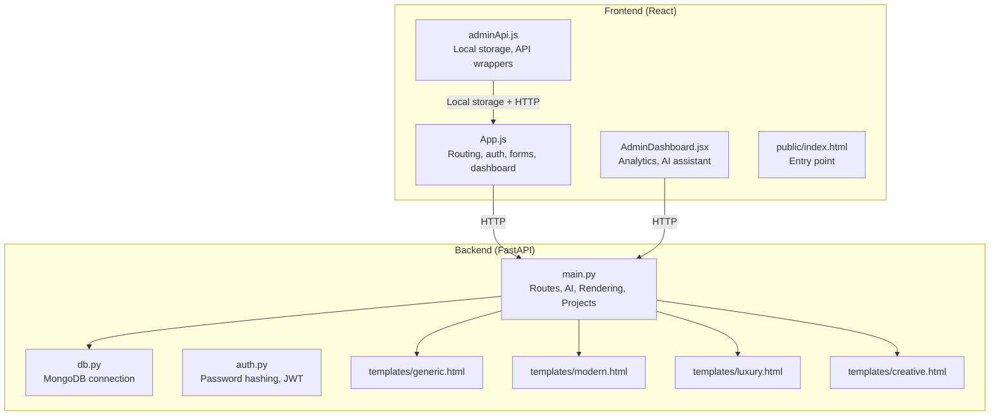
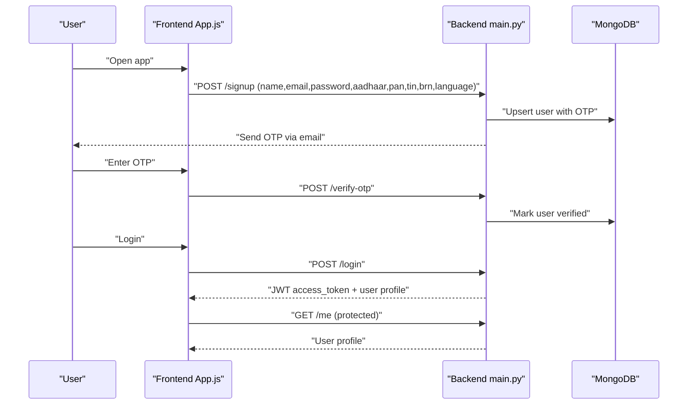
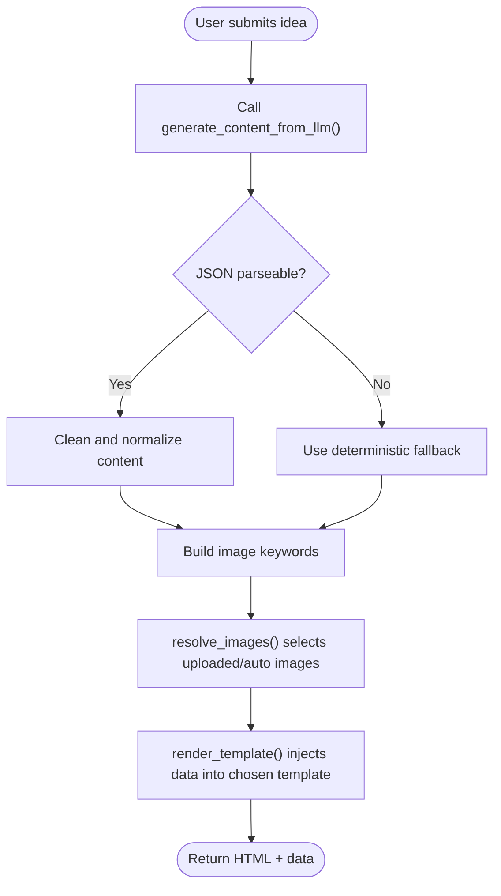
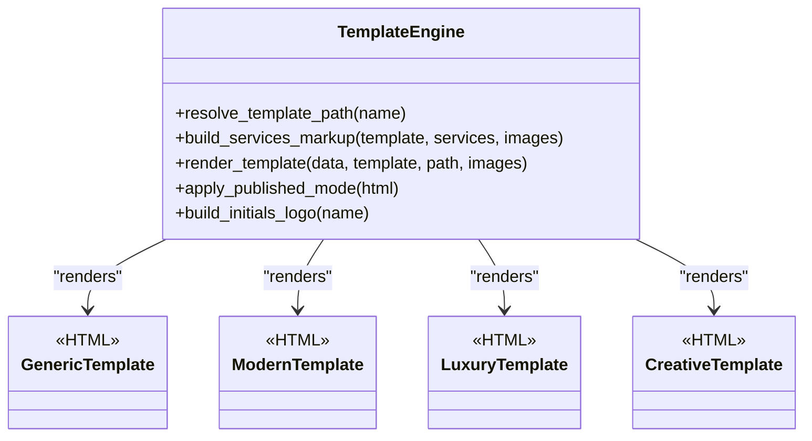
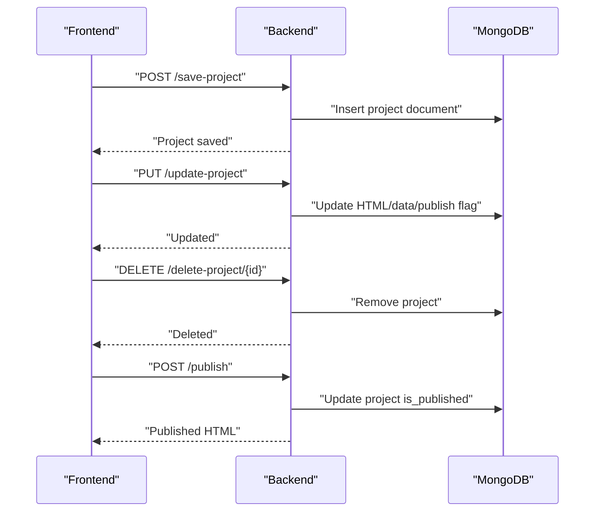
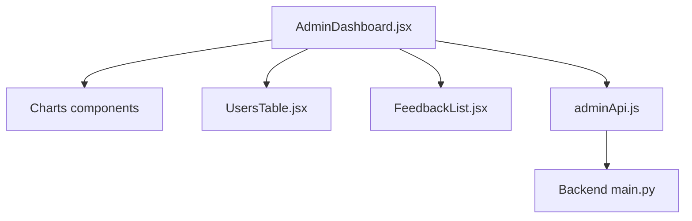
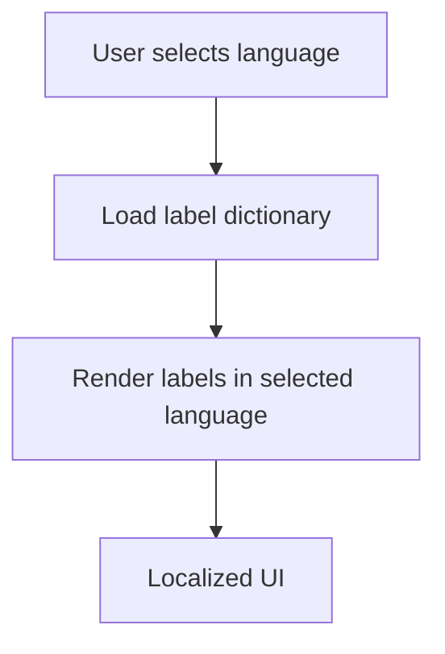
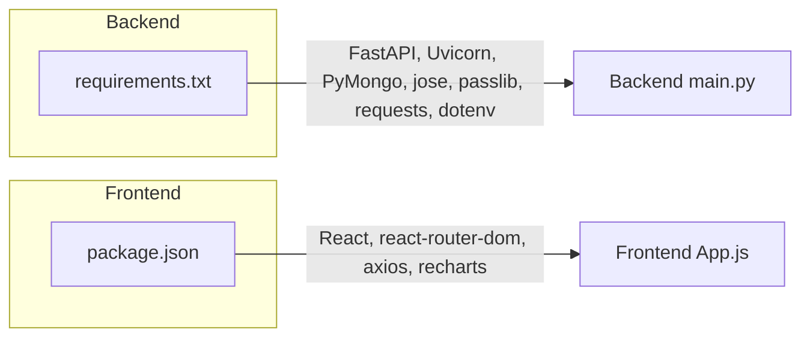

# Project Overview

<cite>
**Referenced Files in This Document**
- [Backend/main.py](file://Backend/main.py)
- [Backend/db.py](file://Backend/db.py)
- [Backend/auth.py](file://Backend/auth.py)
- [Backend/templates/generic.html](file://Backend/templates/generic.html)
- [Backend/templates/modern.html](file://Backend/templates/modern.html)
- [Backend/templates/luxury.html](file://Backend/templates/luxury.html)
- [Backend/templates/creative.html](file://Backend/templates/creative.html)
- [frontend/src/App.js](file://frontend/src/App.js)
- [frontend/src/pages/AdminDashboard.jsx](file://frontend/src/pages/AdminDashboard.jsx)
- [frontend/src/services/adminApi.js](file://frontend/src/services/adminApi.js)
- [frontend/public/index.html](file://frontend/public/index.html)
- [frontend/package.json](file://frontend/package.json)
- [Backend/requirements.txt](file://Backend/requirements.txt)
</cite>

## Table of Contents
1. [Introduction](#introduction)
2. [Project Structure](#project-structure)
3. [Core Components](#core-components)
4. [Architecture Overview](#architecture-overview)
5. [Detailed Component Analysis](#detailed-component-analysis)
6. [Dependency Analysis](#dependency-analysis)
7. [Performance Considerations](#performance-considerations)
8. [Troubleshooting Guide](#troubleshooting-guide)
9. [Conclusion](#conclusion)
10. [Appendices](#appendices)

## Introduction
NITT Website Builder is an AI-powered platform designed to help users rapidly create professional business websites. By combining intelligent content generation powered by an external AI service, a library of customizable templates, and a streamlined user management system, the platform enables both beginners and experienced users to produce polished websites with minimal effort. The backend is a FastAPI application that manages user authentication, project lifecycle, AI content generation, and template rendering. The frontend is a React application offering multilingual support, project management, and an admin analytics dashboard.

## Project Structure
The repository is organized into a backend (FastAPI) and a frontend (React) with shared assets and templates:
- Backend
  - API routes for authentication, project management, publishing, and AI content generation
  - Template rendering engine that injects dynamic content into HTML templates
  - MongoDB integration for persistent user and project data
- Frontend
  - React SPA with routing, authentication guards, and bilingual UI
  - Admin dashboard with analytics charts, user management, and AI-assisted editing
  - Local storage synchronization for offline-first behavior



**Diagram sources**
- [Backend/main.py:34-1104](file://Backend/main.py#L34-L1104)
- [Backend/db.py:1-16](file://Backend/db.py#L1-L16)
- [Backend/auth.py:1-19](file://Backend/auth.py#L1-L19)
- [Backend/templates/generic.html:1-462](file://Backend/templates/generic.html#L1-L462)
- [Backend/templates/modern.html](file://Backend/templates/modern.html)
- [Backend/templates/luxury.html](file://Backend/templates/luxury.html)
- [Backend/templates/creative.html](file://Backend/templates/creative.html)
- [frontend/src/App.js:1-1808](file://frontend/src/App.js#L1-L1808)
- [frontend/src/pages/AdminDashboard.jsx:1-356](file://frontend/src/pages/AdminDashboard.jsx#L1-L356)
- [frontend/src/services/adminApi.js:1-266](file://frontend/src/services/adminApi.js#L1-L266)
- [frontend/public/index.html:1-44](file://frontend/public/index.html#L1-L44)

**Section sources**
- [Backend/main.py:34-1104](file://Backend/main.py#L34-L1104)
- [Backend/db.py:1-16](file://Backend/db.py#L1-L16)
- [Backend/auth.py:1-19](file://Backend/auth.py#L1-L19)
- [Backend/templates/generic.html:1-462](file://Backend/templates/generic.html#L1-L462)
- [frontend/src/App.js:1-1808](file://frontend/src/App.js#L1-L1808)
- [frontend/src/pages/AdminDashboard.jsx:1-356](file://frontend/src/pages/AdminDashboard.jsx#L1-L356)
- [frontend/src/services/adminApi.js:1-266](file://frontend/src/services/adminApi.js#L1-L266)
- [frontend/public/index.html:1-44](file://frontend/public/index.html#L1-L44)

## Core Components
- Authentication and session management
  - Password hashing, JWT-based bearer tokens, OTP verification, and protected routes
- AI content generation pipeline
  - Prompt engineering, external AI API integration, JSON parsing, and deterministic fallbacks
- Template rendering engine
  - Dynamic HTML injection, image resolution, and safe markup generation
- Project lifecycle
  - CRUD operations for saved projects, publish/unpublish, and published website serving
- Admin analytics dashboard
  - User statistics, charts, feedback aggregation, and user deletion
- Multilingual UI
  - Bilingual labels and localized form fields for English, Telugu, and Tamil

Practical examples:
- Business website creation: user submits a business idea, receives AI-generated content and images, selects a template, previews, saves, and publishes
- Template customization: user chooses a template, previews it, and applies AI-assisted edits to headings, colors, and layout
- Project management: user lists projects, views/edit previews, deletes projects, and tracks feedback

**Section sources**
- [Backend/main.py:169-323](file://Backend/main.py#L169-L323)
- [Backend/main.py:628-799](file://Backend/main.py#L628-L799)
- [Backend/main.py:436-617](file://Backend/main.py#L436-L617)
- [Backend/main.py:949-1056](file://Backend/main.py#L949-L1056)
- [frontend/src/pages/AdminDashboard.jsx:1-356](file://frontend/src/pages/AdminDashboard.jsx#L1-L356)
- [frontend/src/App.js:84-121](file://frontend/src/App.js#L84-L121)

## Architecture Overview
The system follows a client-server architecture:
- Frontend (React SPA) communicates with the backend via RESTful HTTP endpoints
- Backend validates requests, authenticates users, orchestrates AI content generation, renders templates, and persists data
- MongoDB stores users and projects
- External AI service powers content generation when configured

```mermaid
graph TB
FE["React Frontend<br/>App.js, AdminDashboard.jsx, adminApi.js"]
BE["FastAPI Backend<br/>main.py"]
DB["MongoDB<br/>users, projects"]
AI["External AI Service<br/>GROQ API"]
TPL["Template Engine<br/>generic/modern/luxury/creative"]
FE --> |fetch()/post| BE
BE --> |CRUD| DB
BE --> |render| TPL
BE --> |generate| AI
```

**Diagram sources**
- [Backend/main.py:34-1104](file://Backend/main.py#L34-L1104)
- [Backend/db.py:1-16](file://Backend/db.py#L1-L16)
- [frontend/src/App.js:1-1808](file://frontend/src/App.js#L1-L1808)
- [frontend/src/pages/AdminDashboard.jsx:1-356](file://frontend/src/pages/AdminDashboard.jsx#L1-L356)
- [frontend/src/services/adminApi.js:1-266](file://frontend/src/services/adminApi.js#L1-L266)

## Detailed Component Analysis

### Authentication and User Management
- Features
  - Registration with PAN validation, OTP delivery via email, and verified sessions
  - Login with JWT bearer tokens and protected routes
  - User deletion and admin-only routes
- Security
  - Password hashing with PBKDF2, JWT signing with HS256, and bearer token extraction
- Frontend integration
  - Stores tokens and user metadata in localStorage, route guards for protected/admin-only access



**Diagram sources**
- [Backend/main.py:195-298](file://Backend/main.py#L195-L298)
- [Backend/auth.py:1-19](file://Backend/auth.py#L1-L19)
- [frontend/src/App.js:268-322](file://frontend/src/App.js#L268-L322)

**Section sources**
- [Backend/main.py:169-323](file://Backend/main.py#L169-L323)
- [Backend/auth.py:1-19](file://Backend/auth.py#L1-L19)
- [frontend/src/App.js:180-248](file://frontend/src/App.js#L180-L248)

### AI Content Generation Pipeline
- Workflow
  - Accepts a business idea, queries the external AI service, parses JSON, cleans content, generates stable images, resolves images, and renders HTML
- Resilience
  - Falls back to deterministic content when the AI service is unavailable
- Frontend integration
  - Tracks AI usage in local storage and exposes an AI assistant panel for guided edits



**Diagram sources**
- [Backend/main.py:628-799](file://Backend/main.py#L628-L799)
- [Backend/main.py:802-845](file://Backend/main.py#L802-L845)
- [Backend/main.py:545-599](file://Backend/main.py#L545-L599)
- [frontend/src/pages/AdminDashboard.jsx:26-137](file://frontend/src/pages/AdminDashboard.jsx#L26-L137)

**Section sources**
- [Backend/main.py:628-799](file://Backend/main.py#L628-L799)
- [Backend/main.py:802-845](file://Backend/main.py#L802-L845)
- [Backend/main.py:545-599](file://Backend/main.py#L545-L599)
- [frontend/src/pages/AdminDashboard.jsx:26-137](file://frontend/src/pages/AdminDashboard.jsx#L26-L137)

### Template Rendering Engine
- Capabilities
  - Supports four templates (generic, modern, luxury, creative)
  - Dynamic content insertion, safe HTML escaping, and image fallback handling
  - Logo generation from business name and per-section image selection
- Publishing mode
  - Adds a published class to the body for styling and behavior differences



**Diagram sources**
- [Backend/main.py:436-617](file://Backend/main.py#L436-L617)
- [Backend/templates/generic.html:1-462](file://Backend/templates/generic.html#L1-L462)
- [Backend/templates/modern.html](file://Backend/templates/modern.html)
- [Backend/templates/luxury.html](file://Backend/templates/luxury.html)
- [Backend/templates/creative.html](file://Backend/templates/creative.html)

**Section sources**
- [Backend/main.py:436-617](file://Backend/main.py#L436-L617)
- [Backend/templates/generic.html:1-462](file://Backend/templates/generic.html#L1-L462)

### Project Lifecycle and Publishing
- Operations
  - List projects, save/update/delete projects, and publish/unpublish
- Persistence
  - Uses MongoDB collections for users and projects
- Published website
  - Serves a published HTML response with a special class applied



**Diagram sources**
- [Backend/main.py:949-1056](file://Backend/main.py#L949-L1056)
- [Backend/db.py:1-16](file://Backend/db.py#L1-L16)

**Section sources**
- [Backend/main.py:949-1056](file://Backend/main.py#L949-L1056)
- [Backend/db.py:1-16](file://Backend/db.py#L1-L16)

### Admin Analytics Dashboard
- Features
  - Stats cards, growth chart, websites-per-day bar chart, AI usage pie chart, users table, and feedback list
  - AI assistant panel with presets and undo/autofix actions
- Data sources
  - Backend admin endpoints plus local storage for offline-first experience



**Diagram sources**
- [frontend/src/pages/AdminDashboard.jsx:1-356](file://frontend/src/pages/AdminDashboard.jsx#L1-L356)
- [frontend/src/services/adminApi.js:1-266](file://frontend/src/services/adminApi.js#L1-L266)
- [Backend/main.py:339-414](file://Backend/main.py#L339-L414)

**Section sources**
- [frontend/src/pages/AdminDashboard.jsx:242-356](file://frontend/src/pages/AdminDashboard.jsx#L242-L356)
- [frontend/src/services/adminApi.js:138-266](file://frontend/src/services/adminApi.js#L138-L266)
- [Backend/main.py:339-414](file://Backend/main.py#L339-L414)

### Multilingual UI (English/Telugu/Tamil)
- Implementation
  - Bilingual label dictionaries and helper functions to display labels in English and native languages
  - Language selector in registration form updates labels dynamically
- Usage
  - Applied across form fields and UI labels for a localized experience



**Diagram sources**
- [frontend/src/App.js:84-121](file://frontend/src/App.js#L84-L121)
- [frontend/src/App.js:324-347](file://frontend/src/App.js#L324-L347)
- [frontend/src/App.js:417-427](file://frontend/src/App.js#L417-L427)

**Section sources**
- [frontend/src/App.js:84-121](file://frontend/src/App.js#L84-L121)
- [frontend/src/App.js:324-347](file://frontend/src/App.js#L324-L347)
- [frontend/src/App.js:417-427](file://frontend/src/App.js#L417-L427)

## Dependency Analysis
- Backend dependencies
  - FastAPI, Uvicorn, PyMongo, python-jose, passlib, requests, python-dotenv
- Frontend dependencies
  - React, react-router-dom, axios, recharts



**Diagram sources**
- [Backend/requirements.txt:1-9](file://Backend/requirements.txt#L1-L9)
- [frontend/package.json:1-43](file://frontend/package.json#L1-L43)

**Section sources**
- [Backend/requirements.txt:1-9](file://Backend/requirements.txt#L1-L9)
- [frontend/package.json:1-43](file://frontend/package.json#L1-L43)

## Performance Considerations
- Image handling
  - Deterministic image URLs reduce network variability; fallbacks ensure resilience
- Template rendering
  - Regex-based replacement and safe escaping minimize XSS risks
- Local storage
  - Offline-first caching reduces server round trips for admin dashboards and user data
- AI generation
  - Timeout and fallback logic prevent long waits; JSON cleaning improves robustness

## Troubleshooting Guide
- Authentication
  - Ensure OTP is delivered and verified; check SMTP environment variables if email is not sent
- AI generation
  - Verify GROQ API key; without it, the system falls back to deterministic content
- Publishing
  - Confirm project ownership and valid ObjectId when publishing
- Admin dashboard
  - If backend endpoints fail, local storage fallbacks still show basic stats and charts

**Section sources**
- [Backend/main.py:119-165](file://Backend/main.py#L119-L165)
- [Backend/main.py:692-716](file://Backend/main.py#L692-L716)
- [Backend/main.py:1065-1096](file://Backend/main.py#L1065-L1096)
- [frontend/src/services/adminApi.js:138-171](file://frontend/src/services/adminApi.js#L138-L171)

## Conclusion
NITT Website Builder combines AI-driven content generation, flexible templating, and robust user/project management into a cohesive platform. Its modular backend and React frontend deliver a scalable solution suitable for rapid business website creation, with multilingual support and admin analytics to enhance usability and oversight.

## Appendices
- Practical workflows
  - Business website creation: idea → AI content + images → template selection → preview → save → publish
  - Template customization: select template → AI assistant presets → apply changes → preview → save
  - Project management: list projects → view/edit → delete → track feedback